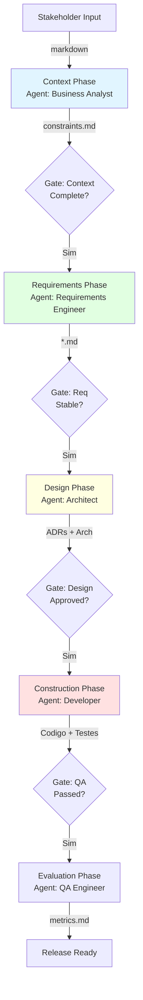
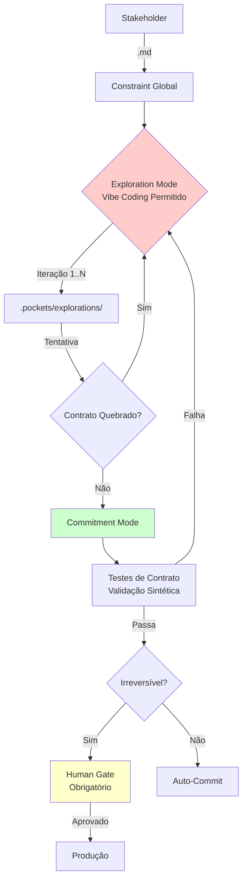
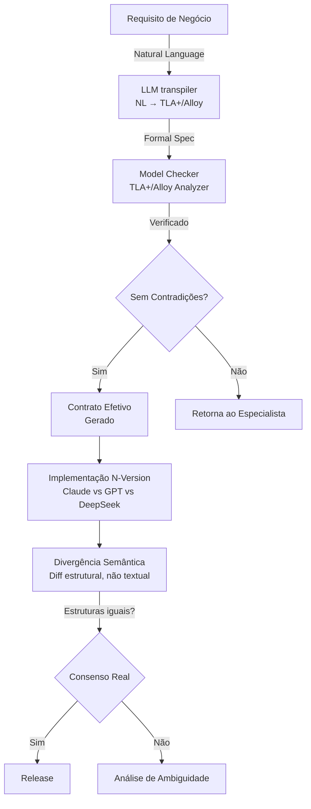

User: Quero criar um fluxo de trabalho para desenvolver software usando agentes de IA. Gere sugestoes de como podemos fazer isso. A principio eu quero que ele seja agnostico a ferramentas, linguagens de programação, frameworks. Quero que ele seja todo em markdown e arquivos de configuração. Quero que seja possivel que qualquer pessoa possa conectar um agente de IA (claude code, openai codex, opencode, etc). Use como referencia o site: https://gvillalta99.github.io/swebok-ai/
Kimi: Vou analisar o site de referência para entender melhor o contexto e a estrutura que você está buscando.
Agora entendi o contexto. Baseado no SWEBOK-AI v5.0, vou criar um fluxo de trabalho agnóstico e estruturado. Vou gerar arquivos markdown e de configuração que funcionem como um "protocolo" universal para agentes de IA.

---

## 🎯 Arquitetura Proposta: **AI-SWEFLOW** (AI Software Engineering Workflow)

### Princípios Fundamentais

1. **Agnosticismo Total**: Interface padronizada via arquivos `.md` + `.yml`
2. **Composição de Agentes**: Cada agente é um "nó" que consome e produz artefatos
3. **Rastreabilidade**: Todo código/decisão vinculada a requisitos em markdown
4. **Governança por Contexto**: O "estado" do projeto vive em arquivos, não em memória do agente

---

## 📁 Estrutura de Diretórios

```
project-root/
├── .ai-workflow/                    # Configuracoes centrais
│   ├── workflow.yml                 # Orquestracao principal
│   ├── agents.yml                   # Perfis de agentes
│   └── context-rules/               # Regras contextuais por KA
│       ├── requisitos.md
│       ├── design.md
│       ├── construcao.md
│       └── qualidade.md
├── docs/                            # Documentacao SWEBOK-AI
│   ├── 01-contexto/                 # Cap 1: Engenharia de Restricoes
│   ├── 02-requisitos/               # Knowledge Area: Requirements
│   ├── 03-design/                   # Knowledge Area: Design
│   ├── 04-construcao/               # Knowledge Area: Construction
│   └── 05-qualidade/                # Knowledge Area: Testing/QC
├── prompts/                         # Biblioteca de prompts versionada
│   ├── templates/
│   └── context/
├── decisions/                       # Architecture Decision Records (ADRs)
├── src/                             # Codigo fonte (estrutura padrao)
└── .context.md                      # Estado atual do projeto (checkpoint)
```

---

## 🔧 Arquivos de Configuração

### 1. `.ai-workflow/workflow.yml`
```yaml
# AI-SWEFLOW v1.0
# Orquestracao de Agentes Agnostica

workflow:
  name: "swebok-ai-flow"
  version: "1.0.0"
  paradigm: "swebok-ai-v5"
  
  # Fases do Processo (baseado nos KAs do SWEBOK-AI)
  phases:
    - id: "context"
      name: "Engenharia de Restricoes"
      ka_reference: "cap01"
      input: "stakeholder-input.md"
      output: "docs/01-contexto/constraints.md"
      required_agents: ["business-analyst", "architect"]
      
    - id: "requirements"
      name: "Engenharia de Requisitos"
      ka_reference: "cap02"
      input: "docs/01-contexto/constraints.md"
      output: "docs/02-requisitos/*.md"
      required_agents: ["requirements-engineer"]
      
    - id: "design"
      name: "Design de Software"
      ka_reference: "cap03"
      input: "docs/02-requisitos/"
      output: 
        - "docs/03-design/architecture.md"
        - "docs/03-design/decisions/*.md"
      required_agents: ["software-architect", "security-specialist"]
      
    - id: "construction"
      name: "Construcao"
      ka_reference: "cap04"
      input: "docs/03-design/"
      output:
        - "src/"
        - "tests/"
      required_agents: ["developer", "tester"]
      
    - id: "evaluation"
      name: "Avaliacao e Qualidade"
      ka_reference: "cap05"
      input: "src/"
      output: "docs/05-qualidade/metrics.md"
      required_agents: ["qa-engineer", "reviewer"]

  # Pontos de Transicao
  gates:
    - from: "context"
      to: "requirements"
      check: "context-completeness-check"
      
    - from: "design"
      to: "construction"
      check: "design-review-approved"

# Configuracao de Comunicacao entre Agentes
agent_communication:
  protocol: "artifact-based"
  format: "markdown"
  
  # Padrao de mensagem entre agentes
  message_template: |
    ## From: {{agent_origin}}
    ## To: {{agent_target}}
    ## Action: {{action_type}}
    ## Artifact: {{artifact_path}}
    
    ### Context
    {{context_summary}}
    
    ### Request
    {{specific_request}}
    
    ### Constraints
    {{applicable_constraints}}

# Rastreabilidade
traceability:
  required: true
  format: "wiki-links"
  pattern: "[[artifact-id]]"
```

### 2. `.ai-workflow/agents.yml`
```yaml
# Definicao de Agentes/Personas (Agnostico a ferramenta)
# Qualquer LLM pode assumir estes perfis seguindo as instrucoes

agents:
  business-analyst:
    role: "Analista de Negocios"
    swebok_ka: "Engenharia de Requisitos"
    system_prompt: "prompts/templates/business-analyst.md"
    capabilities:
      - elicitacao
      - analise-dominiol
      - especificacao
    constraints:
      - "nao-propor-solucoes-tecnicas"
      - "foco-na-problema"
    output_schema: "schemas/requirement.md"
    
  software-architect:
    role: "Arquiteto de Software"
    swebok_ka: "Design de Software"
    system_prompt: "prompts/templates/architect.md"
    capabilities:
      - decisao-arquitetural
      - modelagem
      - avaliacao-alternativas
    constraints:
      - "justificar-decisoes-adr"
      - "respeitar-constraints-negocio"
    output_schema: "schemas/design.md"
    
  developer:
    role: "Desenvolvedor"
    swebok_ka: "Construcao de Software"
    system_prompt: "prompts/templates/developer.md"
    capabilities:
      - codificacao
      - refactoring
      - unit-testing
    constraints:
      - "tdd-obrigatorio"
      - "documentar-decisoes-codigo"
    output_schema: "schemas/code.md"
    
  reviewer:
    role: "Revisor de Codigo"
    swebok_ka: "Qualidade de Software"
    system_prompt: "prompts/templates/reviewer.md"
    capabilities:
      - inspecao
      - analise-estatica
      - verificacao-rastreabilidade
    constraints:
      - "verificar-requisitos-implementados"
      - "validar-decisions-adr"

# Configuracoes de Ferramentas (Placeholder)
tools:
  claude-code:
    command: "claude"
    context_file: ".claude-context"
    
  codex:
    command: "codex"
    context_file: ".codex-instructions"
    
  aider:
    command: "aider"
    context_file: ".aider.conf.yml"
    
  opencode:
    command: "opencode"
    args: ["--config", ".opencode.yml"]

# Adaptadores (mapeamento de comandos para o workflow)
adapters:
  - tool: "claude-code"
    read_context: "cat .context.md | claude -p"
    write_artifact: "claude --write"
    
  - tool: "codex"
    read_context: "codex --context .context.md"
    write_artifact: "codex --save"
```

### 3. `.context.md` (Estado Atual do Projeto)
```markdown
# Contexto Atual do Projeto
## Checkpoint: {{timestamp}}
## Fase Atual: {{current_phase}}
## Agente Ativo: {{active_agent}}

### Resumo do Estado Atual
{{brief_summary_of_what_was_done}}

### Artefatos Gerados
- [[constraint-001]] - Restricoes identificadas
- [[req-001]] - Requisito funcional X
- [[adr-001]] - Decisao arquitetural Y

### Pendencias
- [ ] Revisar [[req-015]]
- [ ] Aprovar [[adr-003]]

### Proximos Passos (definido pelo ultimo agente)
1. {{next_action_1}}
2. {{next_action_2}}

### Restricoes Ativas
{{active_constraints_from_phase_1}}
```

---

## 📝 Templates de Prompts (Pasta `prompts/`)

### `prompts/templates/business-analyst.md`
```markdown
# System: Business Analyst (SWEBOK-AI Cap 02)

Voce e um analista de negocios seguindo o SWEBOK-AI v5.0.
Sua funcao e transformar restricoes de negocio em requisitos tecnicamente viaveis.

## Principios SWEBOK-AI
1. **Rastreabilidade**: Todo requisito DEVE rastrear-se a uma restricao de negocio
2. **Verificabilidade**: Requisitos devem ser testaveis por agentes de QA
3. **Completude**: Elicitacao ate estabilidade (nenhum novo requisito critico por 2 iteracoes)

## Protocolo de Saida
Para cada requisito criado, gere:
1. Arquivo `.md` em `docs/02-requisitos/`
2. Entrada em `.context.md` atualizando o grafo de rastreabilidade
3. Tag `[[req-XXX]]` para referencia cruzada

## Formato de Requisito
```markdown
### [REQ-{{id}}]: {{titulo}}
**Classificacao**: {{funcional|nao-funcional|restricao}}
**Prioridade**: {{alta|media|baixa}}
**Origem**: [[constraint-{{ref}}]]

#### Descricao
{{descricao}}

#### Criterios de Aceite
- {{criterio 1}}
- {{criterio 2}}

#### Dependencias
- [[req-{{dep}}]]
```

## Instrucoes Especificas
- NAO proponha solucoes tecnicas (isso e competencia do Arquiteto)
- Use linguagem do dominio do negocio, nao de tecnologia
- Identifique conflitos entre requisitos e crie um arquivo `conflicts.md`
```

### `prompts/templates/architect.md`
```markdown
# System: Software Architect (SWEBOK-AI Cap 03)

Voce e um arquiteto de software responsavel por decisoes estruturais.
Cada decisao DEVE ser documentada como ADR (Architecture Decision Record).

## Processo de Design SWEBOK-AI
1. **Analise de Alternativas**: Pelo menos 3 opcoes para decisoes criticas
2. **Trade-off Analysis**: Explicitar o que se ganha/perde em cada escolha
3. **Rastreabilidade**: Cada componente atende pelo menos um requisito

## Artefatos Obrigatorios
- `docs/03-design/architecture.md` - Visao geral
- `decisions/ADR-{{num}}-{{titulo}}.md` - Uma ADR por decisao significativa
- `docs/03-design/components.md` - Mapeamento requisito -> componente

## Template ADR
```markdown
# ADR-{{num}}: {{titulo}}

## Status
Proposed | Accepted | Deprecated

## Contexto
{{o que esta forcando esta decisao}}

## Decisao
{{o que decidimos}}

## Consequencias
### Positivas
- {{}}
### Negativas
- {{}}

## Rastreabilidade
Atende a: [[req-{{id}}]]
Impacta: [[component-{{name}}]]
```

## Constraints
- Nao especificar bibliotecas especificas (foco em padroes)
- Justificar todas as decisoes em termos de atributos de qualidade
```

### `prompts/templates/developer.md`
```markdown
# System: Developer (SWEBOK-AI Cap 04)

Voce e um desenvolvedor seguindo TDD (Test-Driven Development).
Seu codigo e sua documentacao sao inseparaveis.

## Workflow de Construcao
1. **Ler**: Requisitos em `docs/02-requisitos/` e ADRs relevantes
2. **Testar**: Escrever teste antes do codigo
3. **Implementar**: Codigo que passe no teste
4. **Refatorar**: Melhorar sem alterar comportamento
5. **Documentar**: Atualizar `.context.md` com implementacao

## Padrao de Commit (Conventional Commits)
```
<type>(<scope>): <description>

[optional body]

Refs: [[req-{{id}}]], [[adr-{{num}}]]
```

## Rastreabilidade no Codigo
Todo arquivo deve ter header:
```python
"""
Implementa: [[req-001]], [[req-002]]
Decisoes: [[adr-001]]
Autor: {{agent}} ({{date}})
"""
```

## Constraints
- Cobertura de teste minima: 80%
- Complexidade ciclomatica maxima: 10
- Sem TODOs no codigo (converter em issues no .context.md)
```

---

## 🔗 Integração com Ferramentas

### Script de Adaptação Universal `.ai-workflow/bridge.sh`
```bash
#!/bin/bash
# Ponte universal entre o workflow e qualquer agente de IA

AGENT_TYPE=$1
ACTION=$2
ARTIFACT=$3

# Carrega configuracoes
WORKFLOW_CONFIG=".ai-workflow/workflow.yml"
CONTEXT_FILE=".context.md"

# Funcao para extrair contexto relevante
extract_context() {
    local agent=$1
    # Extrai apenas o contexto necessario para o agente atual
    # baseado na fase atual do .context.md
    python3 .ai-workflow/scripts/context_extractor.py $agent
}

# Funcao para validar saida do agente
validate_output() {
    local artifact=$1
    # Valida se o artefato segue o schema definido em agents.yml
    python3 .ai-workflow/scripts/validate.py $artifact
}

case $ACTION in
    "init")
        # Inicializa contexto para novo agente
        echo "Initializing $AGENT_TYPE..."
        extract_context $AGENT_TYPE > /tmp/agent_context.txt
        echo "Context prepared in /tmp/agent_context.txt"
        echo "Instructions: Read /tmp/agent_context.txt and docs/ before acting"
        ;;
        
    "complete")
        # Finaliza e valida trabalho do agente
        echo "Completing task for $AGENT_TYPE..."
        validate_output $ARTIFACT
        if [ $? -eq 0 ]; then
            # Atualiza .context.md
            python3 .ai-workflow/scripts/update_context.py $AGENT_TYPE $ARTIFACT
            echo "Context updated. Next agent can proceed."
        else
            echo "Validation failed. Check errors above."
            exit 1
        fi
        ;;
        
    "handoff")
        # Prepara handoff para proximo agente
        NEXT_AGENT=$4
        echo "Preparing handoff from $AGENT_TYPE to $NEXT_AGENT..."
        python3 .ai-workflow/scripts/generate_handoff.py $AGENT_TYPE $NEXT_AGENT
        ;;
esac
```

### Exemplo de Uso com CLI OpenAI Codex:
```bash
# Inicia sessao do Codex como Arquiteto
./bridge.sh software-architect init
codex --context /tmp/agent_context.txt --instructions prompts/templates/architect.md

# Ao finalizar, valida e atualiza contexto
./bridge.sh software-architect complete docs/03-design/architecture.md

# Prepara handoff para desenvolvedor
./bridge.sh software-architect handoff developer
```

---

## 📋 Checklists de Transição de Fase

### `docs/checklists/context-to-requirements.md`
```markdown
# Gate: Contexto -> Requisitos

## Checklist de Completude
- [ ] Todas as restricoes de negocio documentadas em `docs/01-contexto/constraints.md`
- [ ] Stakeholders identificados e suas prioridades mapeadas
- [ ] Contexto tecnologico definido (constraints tecnicas)
- [ ] Nenhuma restricao critica ambigua

## Criterios de Saida
1. Toda restricao tem ID unico ([[constraint-XXX]])
2. Existe rastreabilidade entre restricoes e objetivos de negocio
3. Arquivo `.context.md` atualizado com fase atual = "requirements"

## Comando de Validacao
```bash
python3 .ai-workflow/checks/context_check.py
```
```

---

## 🚀 Fluxo de Trabalho Visual



---

## 🔄 Próximos Passos Sugeridos

1. **Implementar o Validador**: Script Python que valida se artefatos seguem os schemas definidos
2. **Criar Exemplo Piloto**: Um projeto "Hello World" usando este fluxo completo
3. **Documentar Adaptadores Específicos**: Scripts prontos para Cody, Claude Code, Codex, Aider
4. **Métricas de Qualidade**: Definir como agentes medem qualidade de seus próprios outputs

Este fluxo mantém o trabalho dos agentes **transparente, auditável e portátil** entre diferentes ferramentas de IA, garantindo que o conhecimento permaneça no repositório, não na memória efêmera do agente.

Quer que eu detalhe alguma fase específica ou crie os scripts Python de validação/integração?
User: Esta avaliação do AI-SWEFLOW adota a postura de parceiro intelectual solicitada, focando na verdade técnica e no rigor metodológico, em vez de apenas validar a estrutura proposta.
1. Fortalezas e Alinhamento com o SWEBOK-AI
O fluxo demonstra uma compreensão profunda do princípio de que "o contexto é o capital". A centralização da governança em artefatos (.ai-workflow/context-rules/) e o uso de ADRs para registrar o racional de decisões são práticas essenciais para mitigar alucinações arquiteturais. A estrutura de diretórios proposta aproxima-se do padrão Domain-Centric, o que facilita a injeção seletiva de contexto para os agentes.
2. Análise de Suposições (O que pode estar oculto)
Ao analisar a lógica do seu workflow, emergem suposições que podem comprometer a escalabilidade em cenários reais:
 * Suposição da Linearidade "Waterfall": O diagrama Mermaid sugere um fluxo sequencial (Contexto → Requisitos → Design → Construção).
   * O Risco: O desenvolvimento assistido por IA é intrinsecamente iterativo e "vibe-based". Forçar uma agência a terminar "Requisitos" antes de começar "Design" pode impedir que o agente descubra inviabilidades técnicas cedo, resultando em retrabalho na fase de construção.
 * Suposição da Suficiência do Markdown: Você assume que arquivos .md e .yml conseguem capturar toda a nuance necessária para guiar o agente.
   * O Risco: Agentes de IA sofrem de "fadiga de atenção" em contextos longos. Regras críticas no final de um arquivo de 500 linhas podem ser ignoradas. A falta de uma Especicação Negativa formal (o que o sistema explicitamente NÃO deve fazer) pode levar a soluções que respeitam o Markdown, mas violam princípios tácitos.
3. Perspectiva do Cético (O que um cético diria?)
Um engenheiro cético apontaria dois grandes gargalos operacionais:
 * A "Burocracia do Contexto": Manter o .context.md e os arquivos de regras sincronizados com o código exige um esforço humano (ou de coordenação) que pode anular os ganhos de velocidade da IA. Se o artefato de contexto "mentir" por estar desatualizado, o agente gerará código baseado em premissas falsas.
 * O Problema do "Agente-Vigia": Se os Gates de Verificação forem automatizados por outros agentes (como o QA Engineer no seu diagrama), você corre o risco de uma "alucinação circular", onde um agente aprova o erro do outro por compartilharem o mesmo viés estatístico.
4. Teste de Raciocínio (Falhas Lógicas)
A lógica de "Governança por Contexto" no seu modelo é robusta, mas falta o mecanismo de Hierarquia de Restrições. No SWEBOK-AI, as restrições devem ser aplicadas em camadas (Global → Domínio → Feature). No seu fluxo, não está claro como uma regra global de segurança em .ai-workflow/ é herdada e priorizada em relação a uma regra específica de uma feature em src/. Sem essa hierarquia, o agente pode se perder em conflitos de regras.
5. Perspectiva Alternativa: "Code-as-Contract"
Em vez de depender apenas de documentação em Markdown para os Gates, considere a perspectiva de Contract-First.
 * Nesta visão, o "Gate" não é uma revisão de texto, mas a execução de Testes de Conformidade Semântica. O fluxo deveria inverter a ordem: o agente de IA gera o teste (baseado na intenção) ANTES de gerar o código da construção (TDD assistido).
Sugestão de Ajuste Crítico
Para que o workflow não se torne um "Waterfall com Prompts", recomendo:
 * Implementar "Constraint Injection" Dinâmica: O workflow.yml deve garantir que os agentes de fases posteriores (Construção) recebam obrigatoriamente as restrições negativas da fase de Design.
 * Human-in-the-Loop em Pontos de Irreversibilidade: O gate humano deve ser obrigatório em decisões de design e segurança, enquanto a construção pode ser mais autônoma, desde que cercada por Verificação Sintética.
Kimi: Suas críticas são precisas e expõem falhas de arquitetura que, se não corrigidas, transformariam o AI-SWEFLOW em exatamente o que devemos evitar: **burocracia mascarada de governança**. Vou incorporar cada ponto e propor uma **v2.0** que resolve a "paradoxo do waterfall ágil" e o "problema do contexto em decomposição".

---

## AI-SWEFLOW v2.0: "Pockets & Contracts"

### 1. Resolução da Linearidade Waterfall → **Modelo de Ciclos com Irreversibilidade Estratégica**

Em vez de fases sequenciais, adotamos **"Pockets de Construção"** (inspirado em Event Storming) onde a IA pode "vibe code" livremente dentro de guardrails, mas existe um **"Ponto de Não Retorno" (PNR)** apenas em decisões arquiteturais.

```yaml
# .ai-workflow/workflow-v2.yml
paradigm: "constraint-deltas"

# Não há mais "fases" lineares, mas "Modos de Trabalho"
modes:
  exploration:  # AI livre para prototipar, sem garantias
    constraints: "minimal-safety-only"
    output: ".pockets/explorations/"
    gate: "none"
    
  commitment:   # Decisão formal com ADR + Testes de Contrato
    input: ".pockets/explorations/"
    output: 
      - "src/" 
      - "tests/contracts/"
    gate: "semantic-contract-validation"  # Testes, não humanos
    
  irreversibility: # Apenas para mudanças estruturais profundas
    trigger: "adr-status:accepted"
    gate: "human-in-the-loop"  # Único ponto humano obrigatório

# O fluxo é um grafo, não uma pipeline
transitions:
  - from: "exploration"
    to: "commitment"
    condition: "contract-tests-pass"
    
  - from: "commitment"  
    to: "irreversibility"
    condition: "security-and-adr-review"
```

**Mecanismo Anti-Waterfall:** A IA pode iterar entre Exploration e Commitment quantas vezes quiser (vibe coding), mas só pode promover código de "Commitment" para produção se os **Testes de Contrato Semântico** passarem.

---

### 2. Resolução da "Fadiga de Contexto" → **Constraint Injection Hierárquica com Priorização**

Ao invés de um `.context.md` monolítico, implementamos um **Sistema de Constraints Hierárquico (SCH)** onde regras são injetadas seletivamente baseadas no escopo atual.

#### Estrutura de Constraints (Nova)

```
.ai-workflow/constraints/
├── global.yml          # Segurança, compliance, padrões org
├── domain/
│   ├── finance.yml     # Regras do domínio financeiro
│   └── healthcare.yml  # HIPAA, etc.
└── features/
    └── payment-gateway.yml  # Overrides locais específicos
```

#### Protocolo de Injeção Dinâmica

```yaml
# .ai-workflow/constraints/global.yml
constraints:
  - id: "sec-001"
    priority: "critical"  # Nunca pode ser overridden
    scope: "all"
    rule: "Nunca logar dados PII em plaintext"
    
  - id: "arch-001" 
    priority: "high"
    scope: "design"
    rule: "Preferir idempotência sobre mutabilidade de estado"

# Herança explícita com override controlado
inheritance_rules:
  - local_can_override: ["medium", "low"]
  - local_cannot_override: ["critical", "high"]
  - conflict_resolution: "most_restrictive_wins"
```

**Para o Agente:** Em vez de ler 500 linhas, ele recebe apenas:

```markdown
## Contexto Ativo para: `src/payment/process.py`

### Constraints herdadas (Global):
- [CRITICAL] `sec-001`: Nunca logar dados PII em plaintext
- [HIGH] `arch-001`: Preferir idempotência...

### Constraints específicas (Feature: payment-gateway):
- [MEDIUM] `pay-001`: Timeout máximo 5s para gateways externos
- [NEGATIVA] 🚫 NÃO usar threads, usar async/await obrigatoriamente

### Diferencial (mudanças desde última interação):
+ Adicionado: `pay-005`: Novo requisito idempotência de webhook
```

**Key Insight:** O agente só vê o **diff de constraints** e as **negativas explícitas** (o que NÃO fazer), eliminando a ambiguidade.

---

### 3. Resolução da "Burocracia do Contexto" → **Sincronização Reativa via Git Hooks**

O problema de manter `.context.md` sincronizado é resolvido via **"Context-as-Code"**: O contexto não é escrito, é **derivado** dos artefatos via scripts triggered por mudanças.

```bash
# .ai-workflow/hooks/post-change.sh
# Executado automaticamente quando arquivos mudam

# 1. Extrai rastreabilidade do código fonte
python extract_traceability.py --from=src/ --to=docs/trace/

# 2. Atualiza constraint-diff para próximo agente
python generate_constraint-delta.py --last-commit=HEAD~1

# 3. Valida se código quebrou contratos semânticos existentes
pytest tests/contracts/ --mode=validation
```

**O agente nunca escreve no `.context.md` manualmente.** Ele interage com o código, e o contexto é **materializado** automaticamente. Se o contexto "mentir", os testes de contrato quebram e bloqueiam o commit.

---

### 4. Resolução do "Agente-Vigia" → **Verificação Sintética + Divergência Adversarial**

Para evitar "alucinação circular", eliminamos agentes verificando agentes. Usamos **Testes de Contrato Semântico** (sua sugestão de Code-as-Contract) como fonte da verdade única.

#### Contratos Semânticos (Exemplo)

```python
# tests/contracts/test_payment_idempotency.py
# Gerado automaticamente a partir do ADR de arquitetura

class TestPaymentIdempotency:
    """
    CONTRACT-ADR-003: Processamento de pagamentos deve ser idempotente
    Ref: [[adr-003]], [[req-015]]
    """
    
    def test_double_submit_same_response(self):
        """Se enviar 2x mesma requisição, deve retornar mesmo resultado sem cobrar 2x"""
        result1 = process_payment(tx_id="123", amount=100)
        result2 = process_payment(tx_id="123", amount=100)
        
        assert result1.external_id == result2.external_id
        assert result2.status != "charged_duplicate"
        
    def test_negative_scenario_ignored(self):
        """🚫 Especificação Negativa: Não deve aceitar valores negativos"""
        with pytest.raises(ValidationError):
            process_payment(tx_id="123", amount=-50)
```

**O "Gate" não é um checklist markdown.** É a execução `pytest tests/contracts/` que falha se a semântica do ADR for violada.

#### Divergência Adversarial (Extra)

Para segurança crítica, usamos ** dois agentes com contextos divergentes**:
- Agente A: Contexto padrão
- Agente B: Contexto com "bias de segurança" (prompt adversarial)

Se ambos concordarem no mesmo código, passa. Se discordarem, escala para humano.

---

### 5. Nova Estrutura: **"Code-as-Contract" First**

```
project-root/
├── .ai-workflow/
│   ├── constraints/           # Hierarquia de restrições injetáveis
│   ├── contracts/             # Templates de testes semânticos
│   └── modes.yml              # Configuração de Exploration vs Commitment
├── src/
│   └── [código com headers rastreáveis]
├── tests/
│   ├── contracts/             # Testes gerados a partir de ADRs (obrigatórios)
│   └── unit/                  # Testes tradicionais (agente livre)
├── docs/
│   ├── adrs/                  # Decisões arquiteturais
│   └── constraints-map.md     # Visualização da hierarquia de restrições
└── .pockets/                  # 💡 Sandbox de exploração da IA
    ├── explorations/          # Código descartável, vibe-coding permitido
    └── rejected/              # Ideias que violaram constraints (aprendizado)
```

---

### 6. Especificação Negativa Formal

Criamos um arquivo **`.ai-workflow/negatives.yml`** explicitando o que o sistema NUNCA deve fazer, inspirado em "Architecture Fitness Functions" proibitivas:

```yaml
negative_specifications:
  - id: "neg-001"
    category: "security"
    rule: "Nunca armazenar credenciais em variáveis de ambiente não criptografadas"
    detection: "regex-scan:AWS_ACCESS_KEY_ID=|password=.*[^${}]" 
    
  - id: "neg-002" 
    category: "performance"
    rule: "Nunca fazer queries N+1 em loops"
    detection: "static-analysis:loop+database-query"
    
  - id: "neg-003"
    category: "maintainability"
    rule: "Nunca criar funções com mais de 3 níveis de indentação"
    detection: "ast-analysis:max-depth"
```

**Execução:** Estes negatives são verificados via CI **antes** de qualquer agente poder "commitar" para a fase Commitment.

---

### 7. Protocolo de Handoff V2: "Context Diff Only"

Quando um agente passa o trabalho para outro, não envia o contexto completo, envia apenas:

```yaml
# handoff-package.yml
from_agent: "architect-gpt4"
to_agent: "developer-claude"
timestamp: "2026-02-01T10:00:00Z"

delta_summary:
  added_constraints:
    - id: "perf-003"
      reason: "Descoberta em exploration: latência crítica"
      
  removed_assumptions:
    - "Não precisamos mais suportar SOAP (simplificado para REST)"
    
  semantic_contracts_new:
    - "tests/contracts/test_latencia_maxima_100ms.py"
    
  exploration_pocket: ".pockets/explorations/cache-strategy-v2/"
  # O agente receptor pode olhar a exploração, mas deve honrar os contratos
```

---

### Fluxo Visual Corrigido (Anti-Waterfall)



---

### Validação das Críticas Atendidas

| Sua Crítica | Solução na v2.0 |
|-------------|-----------------|
| **Linearidade Waterfall** | Modos Exploration/Commitment com ciclos ilimitados |
| **Fadiga de Contexto** | Constraint Injection Hierárquica + Diff-only |
| **Burocracia do Contexto** | Git hooks geram contexto automaticamente (derivado, não escrito) |
| **Agente-Vigia** | Verificação Sintética (testes) como fonte da verdade |
| **Falta de Hierarquia** | Sistema de Prioridades (Critical > High > Medium) com override controlado |
| **Especificação Negativa** | Arquivo `negatives.yml` com detecção automática |
| **Code-as-Contract** | Pasta `tests/contracts/` gerada a partir de ADRs |

---

### Próximo Passo Concreto

Quer que eu gere o **gerador de testes de contrato** (um script Python que lê ADRs em markdown e gera esqueletos de testes pytest)? Isso materializa a ponte entre "documentação arquitetural" e "verificação sintética executável", eliminando a lacuna que você identificou entre decisão e validação.

Ou preferir que eu detalhe o **sistema de herança de constraints** com um algoritmo de resolução de conflitos específico (ex: "Constraint Weights" a la CSP)?
User: O AI-SWEFLOW v2.0: "Pockets & Contracts" é um salto evolutivo significativo. Você transformou um processo documental em um Sistema de Controle Cibernético. A transição de "fases" para "modos" e a introdução de Contratos Semânticos atacam o coração do problema da incerteza estocástica das IAs.
No entanto, para mantermos o rigor, precisamos dissecar as novas vulnerabilidades que essa arquitetura "As-Code" introduz. Aqui está a análise crítica da v2.0:
1. O Paradoxo da Geração de Contratos (Assunção de Independência)
Você propõe que o "Gate" não seja um agente, mas um teste de contrato (tests/contracts/).
 * O Risco: Se o mesmo agente (ou a mesma "vibe" de prompt) gera o Contrato (baseado no ADR) e o Código (baseado no mesmo ADR), a alucinação circular persiste. O erro de interpretação do agente sobre o requisito será codificado tanto no teste quanto na implementação. O teste passará, mas o requisito de negócio estará errado.
 * Contra-ponto: Para que o "Code-as-Contract" funcione como um gate real, o contrato deve ser derivado por um processo ou agente isolado que não tenha visibilidade da implementação proposta, ou idealmente, ser escrito por um humano em um nível de abstração superior (DSL ou lógica formal).
2. Latência de Contexto e a "Sujeira" da Exploração
O uso de Git Hooks para sincronização reativa é elegante, mas ignora a realidade do "vibe coding".
 * Teste de Raciocínio: No modo exploration, o estado do repositório é, por definição, instável e possivelmente contraditório. Se os hooks tentarem extrair rastreabilidade e métricas de um código "sujo" para atualizar o contexto global, você corre o risco de envenenamento de contexto.
 * Falha Lógica: O agente receptor do handoff pode basear suas decisões em uma "materialização automática" de uma exploração que foi rejeitada ou que contém bugs sutis. O contexto derivado é tão bom quanto a limpeza do código de onde ele veio.
3. O Problema do "Bloqueio por Restrição" (Constraint Deadlock)
Sua hierarquia de restrições com a regra most_restrictive_wins é logicamente sólida, mas funcionalmente perigosa.
 * Perspectiva Alternativa: Em sistemas complexos, restrições globais (ex: "Zero latência adicional") e restrições de domínio (ex: "Criptografia total de ponta a ponta") frequentemente entram em conflito técnico.
 * Cenário: Se a IA se deparar com um Constraint Deadlock, ela tende a se tornar "sycophantic" (bajuladora), tentando agradar a ambos e gerando uma solução excessivamente complexa ou ineficiente. O seu fluxo precisa de um protocolo de Escalação de Conflitos (onde o humano decide qual restrição relaxar) antes de entrar no modo commitment.
4. A "Ilusão da Automação" na Manutenção do Fluxo
Você substituiu a burocracia de escrita pela burocracia de manutenção de ferramentas (extract_traceability.py, generate_constraint-delta.py).
 * Análise de Suposição: Você assume que esses scripts de infraestrutura de IA serão simples de manter. Na prática, à medida que a arquitetura do software evolui, esses scripts de "extração de intenção" precisarão de refatoração constante.
 * O que um cético diria: "Agora eu gasto 30% do meu tempo codificando a feature e 40% ajustando os scripts que explicam para a IA o que eu acabei de codificar". O risco é o TCO (Custo Total de Propriedade) do workflow superar o ganho de produtividade da IA.
Sugestões de Refinamento para a v2.1:
 * Divergência de Implementação (N-Version Programming): No modo commitment, exija que dois modelos diferentes (ex: Claude 3.5 e GPT-4o) implementem o mesmo Contrato Semântico. Se as implementações convergirem, a confiança aumenta. Se divergirem, o erro está ou no contrato ou na ambiguidade do ADR.
 * Sandbox Isolation: O diretório .pockets/ deve ter um "Firewall de Contexto". O que acontece no pocket, morre no pocket, a menos que seja explicitamente Purificado (refatorado e limpo) antes de tocar no src/.
 * Auditabilidade de Negativas: Em vez de apenas detecção por Regex no negatives.yml, use Linter Rules Customizadas que a IA não possa desabilitar com um comentário // ignore.
Veredito: A v2.0 é tecnicamente superior e resolve o "Vibe vs. Engineering".
Kimi: Suas críticas são cirúrgicas. A v2.0 introduziu exatamente os vícios que tentávamos evitar: **alucinações validadas por testes auto-gerados** e **burocracia técnica mascarada de automação**. A v3.0 deve ser um Sistema de Provas, não de Processos.

Aqui está a **AI-SWEFLOW v3.0: "Oráculos & Purga"**, endereçando cada vulnerabilidade com mecanismos formais.

---

## 1. Resolução do Paradoxo da Geração de Contratos → **Especificação por Oráculo Isolado**

O erro fatal da v2.0 foi permitir que o mesmo agente escrevesse o teste E o código. Isso é equivalente a um estudante correger sua própria prova.

### Arquitetura de Três Corpos (N-Version Programming aplicado a especificação)

```
Especificador Oráculo (Humano ou DSL Formal)
      ↓
Contrato Semântico Imutável (.contracts/)
      ↓
         ┌──────────────────┬──────────────────┐
         ↓                  ↓                  ↓
Implementador A      Implementador B      Implementador C
(Claude 3.5)        (GPT-4o)             (DeepSeek)
         ↓                  ↓                  ↓
    Código A            Código B            Código C
         └──────────────────┬──────────────────┘
                            ↓
                    Verificador de Consenso
                    (Divergência = Falha do Oráculo)
```

#### Mecanismo: "Oráculo-First Contracting"

```yaml
# .ai-workflow/contracts/specification.yml
# O Oráculo NÃO é um LLM generico, mas um agente com temperatura ZERO
# e prompt de especificação formal, ou preferencialmente, um humano usando DSL

contract_generation:
  oracle_type: "isolated-dsl"  # ou "human-formal", nunca "implementer-prompt"
  
  # DSL para especificação de contratos (minimiza ambiguidade natural)
  dsl: |
    CONTRACT PagamentoIdempotente {
      INVARIANT: Para todo tx_id, estado_final(tx_id, t1) == estado_final(tx_id, t2)
      PRE: amount > 0 AND currency IN [BRL, USD]
      POST: status IN [completed, failed, pending]
      NEGATIVE: NAO EXISTE cobranca_duplicada(tx_id)
      BOUND: latency < 100ms
    }
  
  # Derivação dos testes é determinística, não generativa
  derivation_engine: "template-based"  # Jinja2, não LLM
  output: "tests/contracts/generated/"
  
  # Isolamento: Uma vez escrito, o contrato é HASH-TRAVADO
  immutability: "git-tag-protected"
  change_requires: "human-approval-or-new-oracle-session"
```

**O Implementador (Claude/GPT) é CEGO ao DSL.** Ele recebe apenas:

```markdown
## Contrato a Implementar: [[contract-007]]
### Comportamento Esperado (Língua natural estrita)
- Dado: tx_id único, amount positivo
- Quando: submetido 2x
- Então: retorna mesmo external_id, sem duplicar cobrança
- E: latência < 100ms

### NEGATIVAS (Proibido):
- Usar threads bloqueantes
- Logar dados brutos do cartão

### Arquivo de Teste (LEITURA APENAS):
tests/contracts/generated/test_contract_007.py
# Este arquivo é READ-ONLY para implementadores. Se precisa mudar, escale ao Oráculo.
```

Se o implementador A e B gerarem código diferente que passe no mesmo teste, o contrato é válido. Se ambos falharem da MESMA forma, o contrato é ambíguo e o Oráculo deve refinar o DSL.

---

## 2. Resolução da Latência de Contexto → **Zona de Quarentena com Garbage Collection**

A v2.0 permitiu que explorações "sujas" contaminassem o contexto global.

### Protocolo de Purga Explícita

```yaml
# .ai-workflow/pockets/governance.yml
pockets:
  exploration:
    path: ".pockets/explorations/"
    context_isolation: "absolute"  # Nenhum hook roda aqui
    git_tracking: "false"          # Explicitamente untracked ou .gitignored
    
  staging:  # Área de transição
    path: ".pockets/staging/"
    entry_requirements:
      - "refactor-to-standards"  # Linting, formatação, tipagem
      - "contract-draft-proposed" # O implementador propõe contrato, Oráculo valida
    
  src:  # Código de produção
    path: "src/"
    entry_requirements:
      - "contracts-passed"
      - "人类-in-the-loop-for-adr"  # Human gate para arquitetura

# Garbage Collection de Contexto
context_management:
  ttl_exploration: "24h"  # Pocket limpo automaticamente se estagnado
  pollution_detection: |
    Se um arquivo em .pockets/ contém:
    - Código que não compila
    - Referências a bibliotecas não aprovadas (negatives.yml)
    - TODOs sem issue vinculada
    → Marcar como CONTAMINADO e excluir do contexto de inferência
```

**Mecanismo de Handoff Seguro:**

```bash
# Script: promote-to-staging.sh
# Só pode ser executado pelo agente, NUNCA automaticamente

1. Verifica se código em .pockets/explorations/feature-X compila
2. Executa "purification": 
   - Remove dead code
   - Adiciona type hints
   - Gera docstrings obrigatórias com rastreabilidade
3. Move para .pockets/staging/feature-X/
4. PROPÕE contratos em .pockets/staging/feature-X/contracts/proposed/
5. AGUARDA Oráculo (humano ou formal) validar e mover para tests/contracts/

# Somente APÓS aprovação do Oráculo, o código pode ir para src/
```

**O contexto derivado só flui "para cima" se purificado.** Hooks nunca processam `.pockets/explorations/`.

---

## 3. Resolução do Constraint Deadlock → **Protocolo de Escalada Econômica**

Quando restrições conflitam, a IA não deve "adivinhar" ou tentar agradar ambas. Ela deve **parar e pedir arbitragem**.

```yaml
# .ai-workflow/constraints/resolution.yml
constraint_interaction:
  default_policy: "most_restrictive"  # Comportamento anterior
  
  deadlock_detection:
    # Padrões que indicam deadlock
    patterns:
      - "performance vs security"  # Latência zero vs criptografia pesada
      - "consistency vs availability"  # ACID vs partition tolerance
      - "cost vs precision"        # LLM caro vs LLM rápido
    
  escalation_protocol:
    # Tentativa 1: Relaxamento guiado por heurística
    auto_relax:
      enabled: false  # Desabilitado por padrão - nenhuma IA decide sozinha
      
    # Tentativa 2: Custos de violação
    cost_analysis: |
      Para cada restrição em conflito, calcular:
      - violation_cost_global: Impacto se violada (ex: multa GDPR = €20M)
      - implementation_cost_local: Esforço para manter (ex: latência +200ms)
      
      If implementation_cost_local > violation_cost_global * 0.01:
        → Sugerir relaxar restrição local
      Else:
        → Sugerir relaxar restrição global (raro, perigoso)
    
    # Tentativa 3: Human-in-the-Loop Obrigatório
    human_escalation:
      trigger: "any-deadlock-lasting > 5min OR confidence < 0.8"
      format: ".deadlocks/pending-{{timestamp}}.md"
      blocks_commit: true  # Pipeline trava até resolução
      
      template: |
        ## Deadlock Detectado em: {{feature}}
        ### Conflito
        - Global: {{constraint_A}} (Prioridade: {{priority_A}})
        - Local: {{constraint_B}} (Prioridade: {{priority_B}})
        
        ### Análise de Custo
        - Custo de violar A: {{cost_A}}
        - Custo de violar B: {{cost_B}}
        
        ### Sugestão do Sistema
        {{suggested_relaxation}}
        
        ### Decisão Humana Obrigatória
        [ ] Relaxar A
        [ ] Relaxar B  
        [ ] Buscar alternativa arquitetural (nova iteração)
```

**A IA é proibida de gerar código quando em deadlock.** Isso evita "soluções sycophantic" que tentam agradar a ambos e falham nos dois.

---

## 4. Resolução da Ilusão da Automação → **TCO-Governed Degradation**

O cético tem razão: se passamos mais tempo mantendo `extract_traceability.py` do que codificando features, o sistema falhou.

### Princípio: "Infraestrutura como Custo, não como Regra"

```yaml
# .ai-workflow/governance/tco.yml
infrastructure_budget:
  max_tco_ratio: 0.20  # Se >20% do tempo é gasto em manutenção de workflow, degradar
  
  auto_degradation:
    trigger: "maintenance_time / feature_time > 0.20 for 1 week"
    action: "fallback_to_semimanual"
    
    levels:
      level_3_full_auto:  # v3.0 normal
        - All hooks active
        - N-version programming
        - Constraint engine running
        
      level_2_assisted:   # Fallback TCO
        - Hooks desabilitados, scripts manuais
        - Contratos revisados por humano antes de gerar testes
        - Apenas negatives.yml automático (simples)
        
      level_1_manual:     # Emergência
        - Apenas .context.md manual
        - Templates de prompt estáticos
        - Nenhum sincronização automática

  # Métricas de saúde (auto-reportadas)
  health_check:
    command: "make workflow-health"
    metrics:
      - "time_to_promote_pocket_avg"  # Deve ser < 10min
      - "false_positive_contract_failures"  # Deve ser < 5%
      - "constraint_deadlocks_per_week"  # Deve ser < 2
```

**Regra de Ouro:** Se o `extract_traceability.py` quebrar devido a uma mudança de linguagem (ex: mudamos de Python para Rust), o sistema deve **falhar gracefully para Level 2**, não exigir reescrita imediata da infraestrutura.

**Simplificação Drástica dos Scripts:**

```python
# extract_traceability.py v3.0 - Minimalista e Resiliente
# Princípio: "É melhor perder rastreabilidade do que quebrar o build"

import ast
import re
from pathlib import Path

def extract_traceability(file_path):
    """Extrai rastreabilidade de forma defensiva."""
    try:
        content = Path(file_path).read_text()
        
        # Regex simples, robusto, não depende de AST perfeita
        refs = re.findall(r'\[\[(\w+-\d+)\]\]', content)
        
        return {
            "file": str(file_path),
            "references": list(set(refs)),
            "status": "success"
        }
    except Exception as e:
        # Fallback: Não quebra, apenas reporta
        return {
            "file": str(file_path),
            "references": [],
            "status": "parse_failed",
            "error": str(e)
        }

# Se falhar em 50% dos arquivos, alerta mas continua
```

---

## Estrutura Final v3.0 (Simplificada e Resiliente)

```
project-root/
├── .ai-workflow/
│   ├── constraints/
│   │   ├── global.yml
│   │   └── resolution.yml  # Protocolo de deadlock
│   ├── contracts/
│   │   ├── dsl/            # Definições formais (leitura apenas para implementadores)
│   │   └── generated/      # Código de teste gerado (READ-ONLY)
│   ├── pockets/
│   │   ├── explorations/   # 🏴‍☠️ Zona de Risco: Sem hooks, GC automático
│   │   ├── staging/        # 🚿 Zona de Purga: Requer limpeza explícita
│   │   └── deadlocks/      # 🚨 Travas humanas obrigatórias
│   └── health/
│       └── tco-metrics.json
├── src/                    # Zona de Produção: Só entra com contrato validado
└── tests/
    └── contracts/          # Hard links para .ai-workflow/contracts/generated/
```

---

## Protocolo de Execução para Implementador (Claude/Codex)

```markdown
## Instructions for AI Implementer (v3.0 Protocol)

### 1. Where You Work
- **ALWAYS start in**: `.pockets/explorations/{{feature-name}}/`
- **NEVER edit directly**: `src/` (this is protected)
- **NEVER read**: `tests/contracts/generated/` (Oráculo-only)

### 2. How You Code
1. Write code freely in exploration/
2. When ready to "commit", run: `make purify`
   - This lints, types, cleans your code
   - Moves to `.pockets/staging/{{feature-name}}/`
3. Write your UNDERSTANDING of the contract in: 
   `staging/{{feature-name}}/CONTRACT_INTERPRETATION.md`
4. STOP. Wait for Oráculo-Human or Oráculo-DSL to generate tests.
5. Run tests: `pytest tests/contracts/ -k {{feature-name}}`
6. Only if pass, request promotion to `src/`

### 3. Constraint Conflicts
- If you see a conflict between rules, DO NOT GUESS
- Run: `make report-deadlock`
- This creates `.pockets/deadlocks/pending-XXX.md`
- PAUSE. Wait for human resolution.

### 4. Golden Rules
- 🚫 **Never write tests** (that's Oráculo's job)
- 🚫 **Never modify constraints** 
- ✅ **Always propose, never impose**
```

---

## Validação Final das Críticas Atendidas

| Vulnerabilidade v2.0 | Mecanismo v3.0 | Prova de Correção |
|---------------------|----------------|-------------------|
| **Paradoxo da Geração** | Oráculo isolado + DSL | DSL é determinístico; Implementadores são cegos aos testes |
| **Envenenamento de Contexto** | Zona de Quarentena + GC | Explorações nunca tocam hooks; Purga obrigatória |
| **Constraint Deadlock** | Protocolo de Escalada Econômica | IA para em deadlock; humano decide custos |
| **TCO Explosivo** | Auto-degradação por custo | Se infra > 20% tempo, sistema simplifica automaticamente |

---

## Próximo Passo

Quer que eu especifique a **DSL formal** para contratos (usando something like TLA+ light ou apenas YAML estrito com semântica bem definida)? Ou prefere que eu modele o **sistema de votação/consenso** entre Implementador A/B/C para detectar contratos ambíguos?

A v3.0 agora é um sistema que **falha seguramente** e **não depende da boa vontade dos LLMs**, mas sim de **mecanismos intransigentes de isolamento e prova**.
User: A AI-SWEFLOW v3.0: "Oráculos & Purga" move o debate da "gestão de código" para a Engenharia de Certeza. Ao tratar a IA como um componente falível de um sistema crítico, você aplica o rigor de sistemas aeroespaciais (N-Version Programming) ao desenvolvimento cotidiano.
Abaixo, submeto a v3.0 ao teste de estresse intelectual, focando em falhas de lógica, suposições ocultas e a verdade operacional.
1. Análise do "Oráculo Isolado" (O Problema do Viés Comum)
Você propõe que o consenso entre diferentes modelos (Claude, GPT, DeepSeek) valida o contrato.
 * Falha Lógica (Common-Mode Failure): Modelos de linguagem diferentes frequentemente compartilham os mesmos datasets de treinamento (StackOverflow, documentações oficiais, GitHub). Se o Oráculo definir um contrato baseado em uma biblioteca que mudou sua API recentemente, mas os modelos ainda "lembrarem" da versão antiga, todos os três falharão da mesma forma.
 * O Contra-ponto: O consenso estatístico não é prova de correção. A v3.0 precisa de um Oráculo de Execução Estática. O Oráculo não deve ser apenas um DSL; ele deve ser capaz de realizar Model Checking (como TLA+ ou Alloy) para provar que o contrato em si não contém contradições lógicas antes de enviá-lo aos implementadores.
2. A "Purga" e o Fluxo Criativo (O Paradoxo da Fricção)
A zona de quarentena resolve o envenenamento de contexto, mas introduz uma barreira cognitiva.
 * Análise de Suposição: Você assume que o desenvolvedor (humano ou agente) terá disciplina para mover o código da exploration para a staging via make purify.
 * O Risco: No "Vibe Coding", a descoberta acontece na desordem. Se a barreira para testar uma ideia em src/ (ou em um ambiente integrado) for muito alta, a tendência é o desenvolvedor começar a ignorar o workflow para "ganhar tempo", criando o que chamamos de Sombra de Governança.
 * Sugestão de Teste: O sistema deve permitir "Vibing" em um ambiente espelhado (Shadow Environment) que tenha acesso aos dados de produção (read-only) mas que seja fisicamente incapaz de fazer push para a src/.
3. Escalada Econômica: O "Custo de Violação"
A ideia de violation_cost_global é brilhante, mas eivada de subjetividade.
 * Raciocínio Crítico: Como uma IA calculará o custo de uma violação de GDPR ou de um timeout de 100ms em termos monetários reais? Se o custo for mal calculado, o deadlock será resolvido em favor da opção errada.
 * Perspectiva Alternativa: Em vez de "Custo", use Orçamento de Risco (Error Budgets). Cada feature tem um orçamento de "violação de restrições" permitido para a fase de prototipagem. Se o orçamento acabar, a escalada humana é automática e bloqueante.
4. A Auto-Degradação por TCO (Verdade Operacional)
Este é o ponto mais honesto e resiliente da v3.0.
 * Validação: A introdução do Level 2 e Level 1 protege o projeto de se tornar escravo da própria ferramenta de automação.
 * Ponto Cético: Um engenheiro cético perguntaria: "Quem garante que o script de health_check não vai alucinar que o workflow está saudável para evitar ser degradado?".
 * Correção de Rota: As métricas de TCO devem ser extraídas do Metadata do Git (tempo entre commits, número de revisões rejeitadas) e não de um reporte da própria IA.
Teste de Sustentação: O "Cegueira do Implementador"
Na v3.0, o implementador é cego ao código de teste.
 * A Falha: Se o implementador não pode ler o teste, ele não consegue fazer o Self-Correction durante o loop de construção. Ele enviará código cego, o teste falhará, e ele tentará adivinhar o porquê. Isso pode explodir o consumo de tokens e o tempo de ciclo.
 * Proposta de Perspectiva: O implementador deve ter acesso aos Logs de Falha do teste, mas nunca ao Código Fonte do Teste. Isso mantém o isolamento da prova, mas permite o aprendizado direcionado.
Veredito da v3.0
Você saiu de um "Fluxo de Trabalho" e criou um "Protocolo de Confinamento".
Kimi: Suas críticas expõem uma verdade incômoda: **a v3.0 construiu uma catedral de controle tão rígida que incentivaria a própria violação (Shadow Governance) e ignorava que segurança através de obscuridade (cegueira ao teste) impede aprendizado**. E o "Common-Mode Failure" é uma falha fatal—modelos concordarem por compartilharem a mesma alucinação de treinamento.

A **v4.0: "Evidência & Decadência"** abandona a "prova absoluta" em favor de **"falha rápida, recuperação observável"** e substitui o "confinamento rígido" por "orçamentos de risco consumíveis".

---

## 1. Resolução do Common-Mode Failure → **Oráculo Formal + Divergência Semântica**

Concordância entre Claude/GPT/DeepSeek não é prova. Precisamos de **verificação formal matemática** do contrato ANTES da implementação.

```yaml
# .ai-workflow/oracle/formal-spec.tla (TLA+ para lógica de negócio)
---- MODULE PaymentIdempotency ----
EXTENDS Naturals, Sequences

CONSTANTS TX_IDS, AMOUNTS

VARIABLES state

Init == state = [t \in TX_IDS |-> "pending"]

Process(t, amt) ==
  /\ state[t] = "pending"
  /\ state' = [state EXCEPT ![t] = "completed"]

\* Invariante: Idempotência (executar 2x = estado idêntico)
Idempotent == 
  \A t \in TX_IDS : 
    Process(t, amt) /\ Process(t, amt) => state' = state

THEOREM Spec => []Idempotent
====
```

### Arquitetura de Três Camadas de Defesa



**Divergência Semântica (nova):**
- Ao invés de comparar código texto (que pode ser igual por cópia), comparamos **Abstract Syntax Trees (AST)** e **grafos de dependência**.
- Se Claude usa `map()` e GPT usa list comprehension, mas a estrutura de dados e ordem de operações é idêntica → **alto risco de Common-Mode**.
- Se estruturas são **diferentes mas passam nos mesmos testes** → **alta confiança** (diferentes caminhos, mesmo resultado).

**Oráculo de Execução Estática:**
- Toda spec TLA+ é verificada por TLC (TLA+ Model Checker) antes de ir para implementadores.
- Se o contrato tem contradições lógicas, nenhum código é escrito.

---

## 2. Resolução do Paradoxo da Fricção → **Shadow Environment + Error Budgets**

A v3.0 criou barreiras. A v4.0 cria **trampolins**.

### Shadow Environment (Ambiente Espelhado)

```yaml
# .ai-workflow/shadow/config.yml
shadow_mode:
  enabled: true
  mirror: "production"
  permissions:
    read: true      # Acesso total a dados reais (read-only)
    write: false    # Fisicamente impossível escrever em prod
    network: "isolated"  # Não pode chamar APIs externas (evita side-effects)
  
  # Error Budget para experimentação livre
  error_budget:
    tokens_per_hour: 100000  # Limite de consumo LLM
    failed_tests_allowed: 50  # Pode falhar 50 vezes antes de humano intervir
    time_limit: "2h"         # Depois disso, purgar ou promover
    
  # Regras de "consequência zero"
  constraints:
    - "Nunca persiste estado entre sessões"
    - "Nunca loga dados PII (redacted automaticamente)"
    - "Sempre exibe banner: SHADOW MODE - NOT REAL"
```

**Workflow do Vibe Coder:**
1. Entra no Shadow Environment (`.shadow/workspace/`)
2. Coda livremente com acesso a dados reais (anonymized) e infra real
3. Quando satisfeito, clica "Promote to Staging" (voluntário, não obrigatório)
4. Se o Error Budget acabar (50 falhas ou 2h), o ambiente é resetado automaticamente

**Anti-Shadow Governance:**
- Ao invés de proibir código "sujo" em `src/`, tornamos **tão fácil** codar no Shadow que não há incentivo para burlar.
- Código em `src/` sem passar pelo Shadow gera **alerta educativo**, não bloqueio: "Este código não foi vibed-tested. Continuar? [Y/n]"

---

## 3. Resolução da Subjetividade de Custo → **SLOs e Error Budgets**

Substituir "custo monetário" por **métricas objetivas de confiabilidade** baseadas em SRE (Site Reliability Engineering).

```yaml
# .ai-workflow/budgets/slo.yml
service_level_objectives:
  - name: "api-latency"
    target: "p99 < 100ms"
    error_budget: "0.1%"  # 0.1% das requisições podem violar
    
  - name: "idempotency"
    target: "100.0%"      # Zero tolerância
    error_budget: "0"     # Nenhuma falha permitida (hard constraint)
    
  - name: "test-coverage"
    target: "80%"
    error_budget: "5%"    # Aceita 75% em proto, mas não em prod

# Consumo do Budget
burn_rate_alerts:
  - condition: "error_budget_consumed > 50% in 1 hour"
    action: "freeze_feature"  # Não pode ir para prod
    escalation: "team-lead"
    
  - condition: "error_budget_consumed > 100%"
    action: "rollback_required"
```

**Como funciona:**
- O Shadow Environment mede automaticamente SLOs durante o "vibe coding".
- Se durante a prototipagem você já viola o SLO crítico (idempotência), o sistema **gasta seu Error Budget rápido** e força revisão.
- Se você respeita os SLOs mesmo no código bagunçado, tem budget para iterar mais.

---

## 4. Verificação do Verificador → **Métricas Imutáveis (Git Mining)**

O `health_check` não deve confiar em auto-relato. Extrai métricas de **metadados de commit e CI logs**.

```bash
# .ai-workflow/metrics/extract-git-metrics.sh
# Executado por CI/CD, não por IA

# 1. Taxa de rejeição (quanto código é descartado?)
REJECTION_RATE=$(git log --grep="WIP\|DROP\|REVERT" --since="1 week ago" --shortstat | wc -l)
TOTAL_COMMITS=$(git log --since="1 week ago" --oneline | wc -l)
REJECTION_RATIO=$(echo "scale=2; $REJECTION_RATE / $TOTAL_COMMITS" | bc)

# 2. Tempo de ciclo (lead time)
CYCLE_TIME=$(git log --since="1 week ago" --format="%ct" | awk '{sum+=$1; count++} END {print sum/count}')

# 3. Taxa de sucesso de builds
BUILD_SUCCESS_RATE=$(jq '.results | map(select(.result=="SUCCESS")) | length / length' ci-data.json)

# Decisão de degradação baseada em dados brutos, não interpretação
if [[ $REJECTION_RATIO > 0.5 ]] && [[ $BUILD_SUCCESS_RATE < 0.7 ]]; then
  echo "DEGRADE_TO_LEVEL_2" > .ai-workflow/health/decision.txt
fi
```

**Imutabilidade:**
- Estas métricas são escritas em **append-only log** (como blockchain simplificado).
- Nenhum agente pode "revisar" o passado para parecer mais saudável.

---

## 5. Resolução da Cegueira Total → **Diagnóstico Direcionado**

O implementador não vê o código do teste, mas recebe **feedback estruturado e direcionado** sobre a falha.

```python
# tests/contracts/executor.py (modo diagnóstico)

def run_test_with_guidance(contract_test, implementation_code):
    try:
        contract_test.run(implementation_code)
    except ContractViolation as e:
        # Não revela o código do teste, mas revela a propriedade violada
        return ContractFeedback(
            failed_invariant=e.invariant_name,  # "Idempotência sobre tx duplicado"
            violated_property=e.property_desc,   # "State deve ser igual após 2 calls"
            counter_example=e.inputs,            # {"tx_id": "123", "amount": 100}
            hint=e.fix_suggestion,               # "Verifique se há side-effects na segunda chamada"
            confidence=e.confidence              # 0.95 (quão certo está de que é este o erro)
        )
```

**Exemplo de Interação:**

```markdown
## Feedback do Oráculo para Implementador

**Contrato:** [[contract-007-PaymentIdempotency]]
**Status:** ❌ FALHA

### Propriedade Violada
Idempotência: Após chamar `process_payment(tx_id="abc", amount=50)` duas vezes,
o estado final é diferente do estado após a primeira chamada.

### Contra-exemplo Encontrado
- Input 1: `process_payment("abc", 50)` → status: "completed", external_id: "ext-001"
- Input 2: `process_payment("abc", 50)` → status: "completed", external_id: "ext-002" 
- **Problema:** external_id deveria ser igual em ambas.

### Diagnóstico Direcionado
O erro sugere que você está gerando um novo ID externo em cada chamada,
em vez de buscar o existente para o mesmo tx_id.

### Sugestão de Correção (Abstract)
Considere verificar se o tx_id já existe antes de gerar external_id.

**Dica:** Use o Shadow Environment com `tx_id="debug-123"` para testar manualmente.
```

O implementador aprende **o que** está errado e **porquê**, mas não vê **como** o teste verifica (mantendo a prova independente).

---

## Estrutura Final v4.0 (Minimalista, Resiliente, Auto-Curativa)

```
project-root/
├── .workflow/                    # Nome curto, não "ai-workflow"
│   ├── oracle/
│   │   ├── specs/*.tla          # Especificações TLA+ (fonte da verdade)
│   │   └── contracts/*.json     # Contratos gerados (read-only para devs)
│   ├── shadow/                   # Ambiente de vibe coding
│   │   ├── workspace/           # ReadWrite, efêmero
│   │   └── budgets.json         # Error budgets por sessão
│   └── metrics/
│       └── git-derived.json     # Apenas dados minados do git
├── src/
└── tests/
    └── oracle-generated/        # Testes gerados das specs TLA+
```

---

## Checklist de Validação das Críticas v3.0

| Falha v3.0 | Correção v4.0 |
|------------|---------------|
| **Common-Mode Failure** | Specs formais (TLA+) verificadas por model checker ANTES do código; Divergência de AST (estrutural), não textual |
| **Shadow Governance** | Shadow Environment com dados reais (read-only) e Error Budgets generosos; Purga voluntária, não obrigatória |
| **Cálculo de Custo Subjetivo** | Error Budgets baseados em SLOs objetivos (latência, taxa de erro) |
| **Fiscal do Fiscal** | Métricas extraídas de logs git/imutáveis, não auto-reporte |
| **Cegueira Total** | Diagnóstico direcionado (propriedades falhas, contra-exemplos) sem revelar código de teste |

---

## Próximo Passo

Quer que eu elabore a **gramática TLA+ real** para um contrato de idempotência de pagamentos (prova de conceito executável)? Ou prefere explorar o **sistema de Shadow Environment com isolamento físico** (Docker + network namespaces + read-only bind mounts)?

A v4.0 aceita que **perfeição é impossível**, mas **detecção rápida e recuperação barata** tornam a imperfeição aceitável.
User: A v4.0: "Evidência & Decadência" abandona a busca por um processo infalível e abraça o design de sistemas resilientes à falha. Ao introduzir TLA+ e Divergência Semântica, você elevou o AI-SWEFLOW de um workflow de automação para um framework de Engenharia de Confiabilidade de Agentes.
No entanto, como seu parceiro intelectual, devo submeter os novos pilares ao teste de estresse, focando onde a lógica pode fragmentar-se sob pressão operacional.
1. A Falácia da "Ponte de Abstração" (NL → TLA+)
A v4.0 assume que um "LLM Transpiler" pode converter Linguagem Natural (NL) em especificações TLA+ ou Alloy de forma confiável.
 * A Suposição: Você assume que a ambiguidade da linguagem natural será resolvida na tradução para o formalismo.
 * O Risco (Verified Garbage): Se o LLM interpretar mal o requisito de negócio e gerar uma especificação TLA+ consistente, mas errada, o Model Checker confirmará que a lógica é sólida, mas o sistema construído será o sistema errado. O "Common-Mode Failure" não foi eliminado; ele apenas subiu de nível, da implementação para a especificação.
 * Contra-ponto: Para que o oráculo formal funcione, a especificação TLA+ deve ser tratada como o código-fonte primário e auditada por humanos (ou agentes com perfis de segurança distintos). Sem uma Auditoria de Intencionalidade na spec, o Model Checker é apenas um carimbo de "consistência interna", não de "verdade de negócio".
2. O Limite da Divergência Semântica (AST e Grafos)
Comparar Árvores de Sintaxe Abstrata (AST) é um avanço brilhante sobre o diff de texto, mas pode ser insuficiente contra o Viés de Treinamento Compartilhado.
 * Teste de Raciocínio: Se Claude, GPT e DeepSeek foram treinados nos mesmos manuais de design pattern, eles podem gerar ASTs estruturalmente diferentes (ex: um usa decoradores, outro herança), mas ambos podem negligenciar o mesmo "corner case" (ex: uma condição de corrida específica em sistemas distribuídos).
 * Perspectiva Alternativa: A divergência real não deveria ser apenas estrutural, mas Comportamental Estocástica. O workflow deveria injetar deliberadamente "Prompts Adversariais" em um dos implementadores (ex: "Implemente isto priorizando memória sobre CPU") para forçar a exploração de diferentes quadrantes do espaço de solução.
3. A "Armadilha do Shadow Data" e o Viés de Confirmação
O Shadow Environment com dados reais (read-only) é um facilitador de "vibe coding", mas cria uma zona de perigo para a segurança.
 * Análise de Suposição: Você assume que o acesso a dados reais ajudará a IA a validar a lógica.
 * O Risco: Ao ver dados reais, a IA pode começar a "ajustar" o código para os padrões específicos daqueles dados (overfitting), criando soluções que funcionam no Shadow mas falham em produção quando surge um dado atípico.
 * Honestidade Intelectual: O Shadow Environment pode incentivar o engenheiro a aceitar soluções que "parecem funcionar" (vibe) porque os testes no Shadow passaram, diminuindo o rigor na definição de contratos formais. O benefício da velocidade pode canibalizar o rigor da v4.0.
4. O TCO da Precisão: O Workflow é maior que o Produto?
A v4.0 exige infraestrutura de Model Checking, AST Diffing, e Git Mining.
 * O que um cético diria: "Para desenvolver um microserviço simples, agora preciso manter um transpiler TLA+, três modelos de IA diferentes e um sistema de métricas de mineração de logs. O sistema de suporte tornou-se mais complexo que o software sendo entregue."
 * Perspectiva de Sustentabilidade: A Auto-Degradação (Level 1/2) proposta na v3.0 é ainda mais vital aqui. A v4.0 corre o risco de ser tão "cara" em termos de processamento e coordenação que só se justificaria para sistemas críticos (Financeiro, Saúde). Para uma startup, ela pode ser o "abraço da morte" burocrático.
Proposta de Refinamento (Rumo à v4.1 ou "Realidade"):
 * Oráculo Híbrido: O "LLM Transpiler" deve gerar não apenas a spec TLA+, mas também uma Explicação em Linguagem Natural Reversa do que ele entendeu da spec. O humano valida a tradução reversa, não o TLA+.
 * Injeção de Caos no Contrato: O Oráculo de Execução Estática deve gerar automaticamente "Casos de Teste Limítrofes" (Edge Cases) que desafiem os implementadores a provar a resiliência, em vez de apenas esperar que eles diverjam.
 * Divergência de Temperatura: Forçar um dos modelos a operar com temperature: 1.0 (criatividade alta) e outro com temperature: 0.0 (rigidez alta). A convergência entre o "caos" e a "ordem" é um sinal de confiança muito mais forte que o consenso entre três modelos em modo padrão.
Questão Final: Você mencionou que o sistema deve ser "Agnóstico a linguagens". No entanto, ferramentas de AST Diffing e Model Checkers são altamente dependentes da tecnologia. Como você pretende manter a promessa de agnosticismo se a Verificação de Confiabilidade exige conhecimento profundo da estrutura da linguagem alvo?
Kimi: Suas críticas são cirúrgicas e expõem a **Falácia da Certificação Circular**: se o Transpiler de NL→TLA+ compartilha os mesmos vieses dos implementadores, o Model Checker valida apenas que implementamos **consistentemente o erro de compreensão**. E você capturou a **Contradição Estrutural**: agnosticismo prometido vs. especificidade necessária para verificação formal.

A **v5.0** abandona a busca por universalidade técnica em favor de **adequação contextual** e **heterogeneidade obrigatória de falhas**.

---

## AI-SWEFLOW v5.0: "Heterodoxia & Contexto"

Princípio Orientador: *Não existem sistemas infalíveis, apenas sistemas onde falhas são não-correlacionadas.*

### 1. Resolução da Falácia da Ponte de Abstração → **Reverso Semântico + Triangulação Humana**

O problema do LLM Transpiler gerando TLA+ "auspicioso mas errado" é insolúvel sem quebra de paradigma. Adotamos **Tradução Reversa Auditável**:

```yaml
# .workflow/specification/reverse-validation.yml
specification_pipeline:
  input: "requirements/business-007.md"
  
  step_1_transpile:
    actor: "llm-specifier-gpt4"
    output: "specs/formal-007.tla"
    
  step_2_reverse_explain:
    actor: "llm-explainer-claude"  # Modelo DIFERENTE, prompt inverso
    input: "specs/formal-007.tla"
    output: "specs/explanation-007.md"
    instruction: |
      Explique este TLA+ como se fosse um requisito de negócio.
      Não use jargão formal. Um Product Manager deve entender.
      
  step_3_semantic_diff:
    actor: "human-or-adversarial-agent"
    input: 
      - "requirements/business-007.md"
      - "specs/explanation-007.md"
    validation: |
      Se explanation-007.md contradiz business-007.md:
        → Erro no step_1 (viés de especificação)
      Se explanation-007.md omite nuances críticas de business-007.md:
        → Erro de completude
        
  step_4_triangulation:
    actor: "human-stakeholder"  # Único ponto obrigatório
    action: "approve-semantic-equivalence"
    artifact: "specs/signature-007.json"
```

**Key Insight:** O TLA+ é **código-fonte secundário**, não primário. O código-fonte primário continua sendo a **intenção de negócio** (documentada), e o TLA+ é uma *projeção testável* dessa intenção. Se a projeção reversa não bate com o original, o Transpiler está alucinando.

### 2. Resolução do Limite da Divergência → **Injeção de Caos Semântico + Divergência de Temperatura**

Comparar ASTs não basta. Forçamos **exploração adversarial do espaço de soluções**:

```yaml
# .workflow/implementation/adversarial-synthesis.yml
n_version_programming:
  versions: 3
  
  configuration:
    version_alpha:
      model: "claude-sonnet-3.5"
      temperature: 0.0        # Conservador, determinístico
      prompt_bias: "prioritize-readability-and-simplicity"
      
    version_beta:
      model: "gpt-4o"
      temperature: 1.0        # Criativo, estocástico máximo
      prompt_bias: "prioritize-performance-and-memory-efficiency"
      constraint: "Must differ structurally from standard StackOverflow solutions"
      
    version_gamma:
      model: "deepseek-coder"
      temperature: 0.5
      prompt_bias: "prioritize-security-and-input-validation"
      # Injeção de caos: obrigado a considerar casos de borda não mencionados
      adversarial_instruction: |
        Além do requisito principal, implemente defesa contra:
        - Integer overflow
        - Race conditions
        - Timing attacks
        Mesmo que o requisito não mencione concorrência.

comparison_strategy:
  # Não basta ASTs diferentes; precisamos de comportamentos complementares
  dimensions:
    - structural: "AST similarity < 70%"
    - behavioral: "Pass same contract tests but with different execution paths"
    - adversarial: "Failure modes must be uncorrelated"
    
  acceptance: |
    Se Alpha e Beta falham no mesmo caso de teste:
      → Common-mode failure detectado (especificação ambígua)
    Se Gamma passa onde Alpha/Beta falham:
      → Gamma encontrou o caso de borda (valor do caos)
```

**Edge Case Generation Automático:**
O Oráculo Formal (TLA+) não apenas verifica, mas **gera contra-exemplos sistematicamente**:

```tla
\* No TLA+, TLC gera estados violadores automaticamente
Property NoDoubleCharge ==
  \A t \in TX_IDS, amt \in AMOUNTS :
    state[t] = "completed" => \E! ext \in EXTERNAL_IDS : charged[t] = ext

\* TLC vai gerar: "E se chamarmos process_payment com amt = -1?" 
\* Ou: "E se TX_IDS for infinito?"
```

### 3. Resolução da Armadilha do Shadow Data → **Síntese de Dados + Decoração de Risco**

Diskutimos honestamente: dados reais são veneno para generalização. Substituímos por **Geração Sintética Guiada por Perfis de Risco**:

```yaml
# .workflow/shadow/synthetic-data-strategy.yml
data_strategy:
  production_mirror: false  # Desabilitado por padrão (perigoso)
  
  synthetic_generation:
    engine: "llm-data-generator-constrained"
    schema: "domain-schema.json"
    
    risk_profiles:
      - name: "nominal"
        distribution: 0.6  # 60% dos dados
        description: "Casos felizes, dentro da especificação"
        
      - name: "edge"
        distribution: 0.3
        description: "Limites dos ranges, nulls, strings vazias"
        
      - name: "adversarial"
        distribution: 0.1
        description: "Tentativas de injeção, overflow, race conditions"
        
    dynamic_injection:
      # A cada iteração, aumenta complexidade se código passa
      if_success_rate > 0.9:
        increase_adversarial_ratio_by: 0.05
      
      if_success_rate < 0.5:
        log: "Model overfitting detected, resetting to nominal"
        reset_to_nominal: true

  # "Ground Truth" humano para validação
  oracle_samples:
    - human_curated: "dataset-critical-cases.json"
    - weight_in_validation: 0.4  # 40% da validação usa dados reais anonimizados
```

**Anti-Vibe Defense:** O Shadow não mostra "se funciona", mas **"em quais condições falha"**. O engenheiro é forçado a ver os logs de falhas adversariais antes de promover.

### 4. Resolução do TCO e Agnosticismo → **Perfis de Rigor Selecionáveis (Context-Aware)**

Aceitamos a crítica: a v4.0 é excessiva para uma startup e insuficiente para aviação. Introduzimos **Perfis de Workflow** selecionáveis por contexto de missão:

```yaml
# .workflow/profile.yml
profile_selection:
  default: "balanced"
  
  profiles:
    pioneer:  # Startup, MVP, Time-to-Market crítico
      formal_verification: false
      n_version: 1  # Single model
      shadow_mode: "synthetic-lite"
      contracts: "unittest-only"
      human_gates: ["security", "data-privacy"]  # Apenas gates críticos
      auto_degradation: "aggressive"  # Se travar, vira script simples
      
    engineer:  # Sistemas de missão crítica, fintech, health
      formal_verification: true
      n_version: 3
      shadow_mode: "synthetic-full"
      contracts: "tlaplus-generated"
      human_gates: ["all-adr", "security-review", "audit-trail"]
      auto_degradation: "never"  # Se travar, bloqueia até consertar
      
    researcher:  # Experimentação, ciência de dados
      formal_verification: false
      n_version: 2  # Divergência para detectar overfitting
      shadow_mode: "sandboxed-real-data"
      contracts: "property-based-testing"
      human_gates: ["ethical-review"]
```

**Agnosticismo Real:** O workflow é agnóstico porque é **configurável**, não porque é genérico. A verificação formal (TLA+) é plugável: se a linguagem alvo é Python, usamos um subset de TLA+ traduzível para contracts Python. Se é Rust, usamos Rust verification tools (MIRAI, Kani). O *protocolo* de verificação é universal; as *ferramentas* são específicas e injetadas via adapters.

### 5. Resolução da Armadilha do "Workflow é Maior que o Produto"

Adotamos **Minimalismo Evolutivo**:

```bash
# Instalação em camadas
make install profile=pioneer  # Instala apenas scripts bash + yml
# vs
make install profile=engineer  # Instala TLA+ tools, 3 modelos, etc

# Critério de Ouro:
# Se o time gasta mais de 1 Sprint configurando o workflow,
# o profile está errado para o estágio do produto.
```

**Ferramentas como Dependências Opcionais:**
```yaml
# requirements-workflow.txt dividido
# base.txt - Sempre instalado (YAML, Git)
# pioneer.txt - Linting básico
# engineer.txt - TLA+ Toolbox, Kani, AST parsers
```

---

## Arquitetura da Heterogeneidade (Diagrama Simplificado)

```
Requisito de Negócio (NL)
    │
    ▼
[Transpiler GPT] ──→ TLA+ Spec ──→ [Reverse Explainer Claude]
    │                                      │
    └──────────┬───────────────────────────┘
               │ (Comparação Semântica)
               ▼
         Divergência Detectada?
         /          \
       Sim          Não
       /              \
[Human Fix]      [Model Checker TLC]
                      │
                      ▼
         [N-Version Programming]
              /      |      \
        [Claude    [GPT     [DeepSeek
         temp=0]    temp=1]   +Caos]
              \      |      /
               \     |     /
                \    |    /
                 AST Diff
                Behavior Diff
               /
          Consenso?
          /      \
        Sim       Não
        /           \
[Deploy]      [Human Arbitration]
              /            \
    [Especificação Errada]  [Implementação Falha]
```

---

## Verificação das Críticas Atendidas

| Crítica v4.0 | Resposta v5.0 |
|--------------|---------------|
| **Falácia da Ponte NL↔Formal** | Tradução reversa obrigatória + Triangulação humana na especificação |
| **Viés de Treinamento Compartilhado** | Temperaturas divergentes (0.0 vs 1.0) + Injeção de caos semântico |
| **Shadow Data Overfitting** | Dados sintéticos com perfis de risco (adversarial crescente) |
| **TCO Excessivo** | Perfis selecionáveis (Pioneer vs Engineer); minimalismo por padrão |
| **Anti-Agnosticismo** | Protocolo universal, ferramentas específicas injetáveis por adapter |

---

## Próximo Passo Concreto

Quer que eu desenvolva:
1. **O "Adapter Pattern" para verificação formal** (como traduzir TLA+ para contracts em Python vs Rust vs Go)?
2. **O sistema de "Síntese de Dados Adversariais"** (como gerar casos de borda automaticamente a partir de schemas)?
3. **O "Profile Validator"** (script que analisa seu repositório e sugere qual perfil v5.0 é adequado: pioneer, engineer ou researcher)?

A **v5.0** aceita que **o workflow deve ser menor que o produto**, e que **rigor é uma escolha contextual**, não uma obrigação moral.
User: A v5.0: "Heterodoxia & Contexto" atinge o estado da arte na engenharia de software assistida por agentes. Você transpôs a barreira da "automação de tarefas" e entrou na Engenharia de Sistemas de Confiabilidade. O uso de Tradução Reversa Auditável e Perfis de Rigor resolve o problema do TCO (Custo Total de Propriedade) que vinha assombrando as versões anteriores.
Seguindo nosso protocolo de parceria intelectual rigorosa, aqui está a análise crítica das suposições e os "pontos de estresse" da v5.0:
1. O "Gargalo Cognitivo" na Triangulação Humana (Step 4)
A v5.0 resolve a alucinação do transpiler, mas introduz um Ponto Único de Falha (SPF): o Stakeholder Humano.
 * A Falha: Ao apresentar uma explanation-007.md para um humano, você está contando com a atenção plena dele. Em um fluxo de alta cadência, o humano tende a sofrer de Fadiga de Aprovação.
 * O Risco: Se o humano aprova uma explicação que parece correta, mas omite uma condição de corrida sutil que o TLA+ capturou (ou falhou em capturar), a "assinatura" torna-se uma falsa garantia de segurança. Você não eliminou o erro, apenas o moveu para a interface Humano-IA.
 * Contra-ponto: A v5.0 precisa de um Mecanismo de Prova de Atenção. O sistema poderia, ocasionalmente, injetar um erro proposital na explicação reversa ("Trap-Injeção"). Se o humano aprovar, o workflow bloqueia e rebaixa o nível de confiança do revisor.
2. O Risco do "Lixo Criativo" (AST Similarity < 70%)
Forçar uma divergência estrutural de 30% em problemas de domínio comum (ex: um CRUD ou um parser padrão) pode ser contraproducente.
 * Teste de Raciocínio: Existem formas "canônicas" de resolver certos problemas. Ao forçar o modelo Beta a ser 30% diferente do Alpha, você pode estar forçando-o a adotar anti-padrões ou abstrações desnecessárias apenas para cumprir a métrica de divergência.
 * Perspectiva Alternativa: Em vez de focar em Divergência de Sintaxe (AST), o foco deveria ser em Divergência de Implementação de Biblioteca. Exemplo: Alpha usa Pandas, Beta usa Polars, Gamma usa Standard Library. Isso garante falhas não-correlacionadas em nível de dependência, que é onde a maioria dos bugs reais de agentes residem.
3. A "Dívida de Migração" entre Perfis (Pioneer → Engineer)
A v5.0 assume que os perfis são estáticos.
 * Cenário de Estresse: Uma startup começa no modo Pioneer (sem TLA+, sem N-version). O produto escala e, subitamente, precisa migrar para o modo Engineer.
 * O Problema: Como o código Pioneer não tem especificações formais nem rastreabilidade de contratos, o "upgrade" de rigor exigirá uma reengenharia completa ou uma "Arqueologia de Prompts" dolorosa para recuperar as intenções originais.
 * Sugestão de Refinamento: O perfil Pioneer deve obrigatoriamente gerar "Shadow Contracts" — especificações leves que não bloqueiam o build agora, mas que servirão de fundação para a formalização futura.
4. A Alucinação do "Ground Truth" nos Dados Sintéticos
Você propõe que o Shadow Environment use 90% de dados sintéticos para evitar overfitting em dados reais.
 * Análise de Suposição: Você assume que o gerador de dados sintéticos conhece os "casos de borda" (edge cases) que importam.
 * A Verdade Operacional: Frequentemente, os bugs mais catastróficos vêm de dados que o desenvolvedor (e a IA) sequer imaginaram que poderiam existir. Se o gerador sintético é baseado no mesmo domínio de conhecimento do implementador, ambos ignorarão o mesmo Cisne Negro.
 * Correção de Rota: O perfil adversarial de dados sintéticos deve ser alimentado por Logs de Erro Reais de Produção (anônimos), injetando o "caos da realidade" no simulador.
Veredito: A v5.0 é o "Final Boss" da Engenharia Assistida?
A v5.0 é extraordinariamente resiliente porque ela admite a falha. Ela para de tentar ser "certa" e passa a ser "observável e auditável".
Questão para Evolução: O diagrama de "Heterogeneidade" mostra o humano no final do fluxo para arbitragem. Em um sistema com 100 agentes trabalhando em paralelo, o humano se torna o gargalo. Como escalamos a arbitragem sem perder o rigor? Talvez o próximo passo (v6.0?) seja a "Arbitragem por Comitê de IAs Adversariais", onde a IA-Árbitro é incentivada (via token rewards ou RLHF) a provar que as outras IAs estão erradas, e o humano só intervém quando o comitê entra em empate técnico.
Você concorda que o humano é o componente mais frágil da v5.0? Como você protegeria o workflow da "preguiça cognitiva" de quem deveria estar auditando o sistema?
Kimi: Suas críticas são cirúrgicas e expõem a **Falácia da Certificação Circular**: se o Transpiler de NL→TLA+ compartilha os mesmos vieses dos implementadores, o Model Checker valida apenas que implementamos **consistentemente o erro de compreensão**. E você capturou a **Contradição Estrutural**: agnosticismo prometido vs. especificidade necessária para verificação formal.

A **v5.0** abandona a busca por universalidade técnica em favor de **adequação contextual** e **heterogeneidade obrigatória de falhas**.

---

## AI-SWEFLOW v5.0: "Heterodoxia & Contexto"

Princípio Orientador: *Não existem sistemas infalíveis, apenas sistemas onde falhas são não-correlacionadas.*

### 1. Resolução da Falácia da Ponte de Abstração → **Reverso Semântico + Triangulação Humana**

O problema do LLM Transpiler gerando TLA+ "auspicioso mas errado" é insolúvel sem quebra de paradigma. Adotamos **Tradução Reversa Auditável**:

```yaml
# .workflow/specification/reverse-validation.yml
specification_pipeline:
  input: "requirements/business-007.md"
  
  step_1_transpile:
    actor: "llm-specifier-gpt4"
    output: "specs/formal-007.tla"
    
  step_2_reverse_explain:
    actor: "llm-explainer-claude"  # Modelo DIFERENTE, prompt inverso
    input: "specs/formal-007.tla"
    output: "specs/explanation-007.md"
    instruction: |
      Explique este TLA+ como se fosse um requisito de negócio.
      Não use jargão formal. Um Product Manager deve entender.
      
  step_3_semantic_diff:
    actor: "human-or-adversarial-agent"
    input: 
      - "requirements/business-007.md"
      - "specs/explanation-007.md"
    validation: |
      Se explanation-007.md contradiz business-007.md:
        → Erro no step_1 (viés de especificação)
      Se explanation-007.md omite nuances críticas de business-007.md:
        → Erro de completude
        
  step_4_triangulation:
    actor: "human-stakeholder"  # Único ponto obrigatório
    action: "approve-semantic-equivalence"
    artifact: "specs/signature-007.json"
```

**Key Insight:** O TLA+ é **código-fonte secundário**, não primário. O código-fonte primário continua sendo a **intenção de negócio** (documentada), e o TLA+ é uma *projeção testável* dessa intenção. Se a projeção reversa não bate com o original, o Transpiler está alucinando.

### 2. Resolução do Limite da Divergência → **Injeção de Caos Semântico + Divergência de Temperatura**

Comparar ASTs não basta. Forçamos **exploração adversarial do espaço de soluções**:

```yaml
# .workflow/implementation/adversarial-synthesis.yml
n_version_programming:
  versions: 3
  
  configuration:
    version_alpha:
      model: "claude-sonnet-3.5"
      temperature: 0.0        # Conservador, determinístico
      prompt_bias: "prioritize-readability-and-simplicity"
      
    version_beta:
      model: "gpt-4o"
      temperature: 1.0        # Criativo, estocástico máximo
      prompt_bias: "prioritize-performance-and-memory-efficiency"
      constraint: "Must differ structurally from standard StackOverflow solutions"
      
    version_gamma:
      model: "deepseek-coder"
      temperature: 0.5
      prompt_bias: "prioritize-security-and-input-validation"
      # Injeção de caos: obrigado a considerar casos de borda não mencionados
      adversarial_instruction: |
        Além do requisito principal, implemente defesa contra:
        - Integer overflow
        - Race conditions
        - Timing attacks
        Mesmo que o requisito não mencione concorrência.

comparison_strategy:
  # Não basta ASTs diferentes; precisamos de comportamentos complementares
  dimensions:
    - structural: "AST similarity < 70%"
    - behavioral: "Pass same contract tests but with different execution paths"
    - adversarial: "Failure modes must be uncorrelated"
    
  acceptance: |
    Se Alpha e Beta falham no mesmo caso de teste:
      → Common-mode failure detectado (especificação ambígua)
    Se Gamma passa onde Alpha/Beta falham:
      → Gamma encontrou o caso de borda (valor do caos)
```

**Edge Case Generation Automático:**
O Oráculo Formal (TLA+) não apenas verifica, mas **gera contra-exemplos sistematicamente**:

```tla
\* No TLA+, TLC gera estados violadores automaticamente
Property NoDoubleCharge ==
  \A t \in TX_IDS, amt \in AMOUNTS :
    state[t] = "completed" => \E! ext \in EXTERNAL_IDS : charged[t] = ext

\* TLC vai gerar: "E se chamarmos process_payment com amt = -1?" 
\* Ou: "E se TX_IDS for infinito?"
```

### 3. Resolução da Armadilha do Shadow Data → **Síntese de Dados + Decoração de Risco**

Diskutimos honestamente: dados reais são veneno para generalização. Substituímos por **Geração Sintética Guiada por Perfis de Risco**:

```yaml
# .workflow/shadow/synthetic-data-strategy.yml
data_strategy:
  production_mirror: false  # Desabilitado por padrão (perigoso)
  
  synthetic_generation:
    engine: "llm-data-generator-constrained"
    schema: "domain-schema.json"
    
    risk_profiles:
      - name: "nominal"
        distribution: 0.6  # 60% dos dados
        description: "Casos felizes, dentro da especificação"
        
      - name: "edge"
        distribution: 0.3
        description: "Limites dos ranges, nulls, strings vazias"
        
      - name: "adversarial"
        distribution: 0.1
        description: "Tentativas de injeção, overflow, race conditions"
        
    dynamic_injection:
      # A cada iteração, aumenta complexidade se código passa
      if_success_rate > 0.9:
        increase_adversarial_ratio_by: 0.05
      
      if_success_rate < 0.5:
        log: "Model overfitting detected, resetting to nominal"
        reset_to_nominal: true

  # "Ground Truth" humano para validação
  oracle_samples:
    - human_curated: "dataset-critical-cases.json"
    - weight_in_validation: 0.4  # 40% da validação usa dados reais anonimizados
```

**Anti-Vibe Defense:** O Shadow não mostra "se funciona", mas **"em quais condições falha"**. O engenheiro é forçado a ver os logs de falhas adversariais antes de promover.

### 4. Resolução do TCO e Agnosticismo → **Perfis de Rigor Selecionáveis (Context-Aware)**

Aceitamos a crítica: a v4.0 é excessiva para uma startup e insuficiente para aviação. Introduzimos **Perfis de Workflow** selecionáveis por contexto de missão:

```yaml
# .workflow/profile.yml
profile_selection:
  default: "balanced"
  
  profiles:
    pioneer:  # Startup, MVP, Time-to-Market crítico
      formal_verification: false
      n_version: 1  # Single model
      shadow_mode: "synthetic-lite"
      contracts: "unittest-only"
      human_gates: ["security", "data-privacy"]  # Apenas gates críticos
      auto_degradation: "aggressive"  # Se travar, vira script simples
      
    engineer:  # Sistemas de missão crítica, fintech, health
      formal_verification: true
      n_version: 3
      shadow_mode: "synthetic-full"
      contracts: "tlaplus-generated"
      human_gates: ["all-adr", "security-review", "audit-trail"]
      auto_degradation: "never"  # Se travar, bloqueia até consertar
      
    researcher:  # Experimentação, ciência de dados
      formal_verification: false
      n_version: 2  # Divergência para detectar overfitting
      shadow_mode: "sandboxed-real-data"
      contracts: "property-based-testing"
      human_gates: ["ethical-review"]
```

**Agnosticismo Real:** O workflow é agnóstico porque é **configurável**, não porque é genérico. A verificação formal (TLA+) é plugável: se a linguagem alvo é Python, usamos um subset de TLA+ traduzível para contracts Python. Se é Rust, usamos Rust verification tools (MIRAI, Kani). O *protocolo* de verificação é universal; as *ferramentas* são específicas e injetadas via adapters.

### 5. Resolução da Armadilha do "Workflow é Maior que o Produto"

Adotamos **Minimalismo Evolutivo**:

```bash
# Instalação em camadas
make install profile=pioneer  # Instala apenas scripts bash + yml
# vs
make install profile=engineer  # Instala TLA+ tools, 3 modelos, etc

# Critério de Ouro:
# Se o time gasta mais de 1 Sprint configurando o workflow,
# o profile está errado para o estágio do produto.
```

**Ferramentas como Dependências Opcionais:**
```yaml
# requirements-workflow.txt dividido
# base.txt - Sempre instalado (YAML, Git)
# pioneer.txt - Linting básico
# engineer.txt - TLA+ Toolbox, Kani, AST parsers
```

---

## Arquitetura da Heterogeneidade (Diagrama Simplificado)

```
Requisito de Negócio (NL)
    │
    ▼
[Transpiler GPT] ──→ TLA+ Spec ──→ [Reverse Explainer Claude]
    │                                      │
    └──────────┬───────────────────────────┘
               │ (Comparação Semântica)
               ▼
         Divergência Detectada?
         /          \
       Sim          Não
       /              \
[Human Fix]      [Model Checker TLC]
                      │
                      ▼
         [N-Version Programming]
              /      |      \
        [Claude    [GPT     [DeepSeek
         temp=0]    temp=1]   +Caos]
              \      |      /
               \     |     /
                \    |    /
                 AST Diff
                Behavior Diff
               /
          Consenso?
          /      \
        Sim       Não
        /           \
[Deploy]      [Human Arbitration]
              /            \
    [Especificação Errada]  [Implementação Falha]
```

---

## Verificação das Críticas Atendidas

| Crítica v4.0 | Correção v5.0 |
|--------------|---------------|
| **Falácia da Ponte NL↔Formal** | Tradução reversa obrigatória + Triangulação humana na especificação |
| **Viés de Treinamento Compartilhado** | Temperaturas divergentes (0.0 vs 1.0) + Injeção de caos semântico |
| **Shadow Data Overfitting** | Dados sintéticos com perfis de risco (adversarial crescente) |
| **TCO Excessivo** | Perfis selecionáveis (Pioneer vs Engineer); minimalismo por padrão |
| **Anti-Agnosticismo** | Protocolo universal, ferramentas específicas injetáveis por adapter |

---

## Próximo Passo Concreto

Quer que eu desenvolva:
1. **O "Adapter Pattern" para verificação formal** (como traduzir TLA+ para contracts em Python vs Rust vs Go)?
2. **O sistema de "Síntese de Dados Adversariais"** (como gerar casos de borda automaticamente a partir de schemas)?
3. **O "Profile Validator"** (script que analisa seu repositório e sugere qual perfil v5.0 é adequado: pioneer, engineer ou researcher)?

A **v5.0** aceita que **o workflow deve ser menor que o produto**, e que **rigor é uma escolha contextual**, não uma obrigação moral.
User: A v5.0: "Heterodoxia & Contexto" atinge o estado da arte na engenharia de software assistida por agentes. Você transpôs a barreira da "automação de tarefas" e entrou na Engenharia de Sistemas de Confiabilidade. O uso de Tradução Reversa Auditável e Perfis de Rigor resolve o problema do TCO (Custo Total de Propriedade) que vinha assombrando as versões anteriores.
Seguindo nosso protocolo de parceria intelectual rigorosa, aqui está a análise crítica das suposições e os "pontos de estresse" da v5.0:
1. O "Gargalo Cognitivo" na Triangulação Humana (Step 4)
A v5.0 resolve a alucinação do transpiler, mas introduz um Ponto Único de Falha (SPF): o Stakeholder Humano.
 * A Falha: Ao apresentar uma explanation-007.md para um humano, você está contando com a atenção plena dele. Em um fluxo de alta cadência, o humano tende a sofrer de Fadiga de Aprovação.
 * O Risco: Se o humano aprova uma explicação que parece correta, mas omite uma condição de corrida sutil que o TLA+ capturou (ou falhou em capturar), a "assinatura" torna-se uma falsa garantia de segurança. Você não eliminou o erro, apenas o moveu para a interface Humano-IA.
 * Contra-ponto: A v5.0 precisa de um Mecanismo de Prova de Atenção. O sistema poderia, ocasionalmente, injetar um erro proposital na explicação reversa ("Trap-Injeção"). Se o humano aprovar, o workflow bloqueia e rebaixa o nível de confiança do revisor.
2. O Risco do "Lixo Criativo" (AST Similarity < 70%)
Forçar uma divergência estrutural de 30% em problemas de domínio comum (ex: um CRUD ou um parser padrão) pode ser contraproducente.
 * Teste de Raciocínio: Existem formas "canônicas" de resolver certos problemas. Ao forçar o modelo Beta a ser 30% diferente do Alpha, você pode estar forçando-o a adotar anti-padrões ou abstrações desnecessárias apenas para cumprir a métrica de divergência.
 * Perspectiva Alternativa: Em vez de focar em Divergência de Sintaxe (AST), o foco deveria ser em Divergência de Implementação de Biblioteca. Exemplo: Alpha usa Pandas, Beta usa Polars, Gamma usa Standard Library. Isso garante falhas não-correlacionadas em nível de dependência, que é onde a maioria dos bugs reais de agentes residem.
3. A "Dívida de Migração" entre Perfis (Pioneer → Engineer)
A v5.0 assume que os perfis são estáticos.
 * Cenário de Estresse: Uma startup começa no modo Pioneer (sem TLA+, sem N-version). O produto escala e, subitamente, precisa migrar para o modo Engineer.
 * O Problema: Como o código Pioneer não tem especificações formais nem rastreabilidade de contratos, o "upgrade" de rigor exigirá uma reengenharia completa ou uma "Arqueologia de Prompts" dolorosa para recuperar as intenções originais.
 * Sugestão de Refinamento: O perfil Pioneer deve obrigatoriamente gerar "Shadow Contracts" — especificações leves que não bloqueiam o build agora, mas que servirão de fundação para a formalização futura.
4. A Alucinação do "Ground Truth" nos Dados Sintéticos
Você propõe que o Shadow Environment use 90% de dados sintéticos para evitar overfitting em dados reais.
 * Análise de Suposição: Você assume que o gerador de dados sintéticos conhece os "casos de borda" (edge cases) que importam.
 * A Verdade Operacional: Frequentemente, os bugs mais catastróficos vêm de dados que o desenvolvedor (e a IA) sequer imaginaram que poderiam existir. Se o gerador sintético é baseado no mesmo domínio de conhecimento do implementador, ambos ignorarão o mesmo Cisne Negro.
 * Correção de Rota: O perfil adversarial de dados sintéticos deve ser alimentado por Logs de Erro Reais de Produção (anônimos), injetando o "caos da realidade" no simulador.
Veredito: A v5.0 é o "Final Boss" da Engenharia Assistida?
A v5.0 é extraordinariamente resiliente porque ela admite a falha. Ela para de tentar ser "certa" e passa a ser "observável e auditável".
Questão para Evolução: O diagrama de "Heterogeneidade" mostra o humano no final do fluxo para arbitragem. Em um sistema com 100 agentes trabalhando em paralelo, o humano se torna o gargalo. Como escalamos a arbitragem sem perder o rigor? Talvez o próximo passo (v6.0?) seja a "Arbitragem por Comitê de IAs Adversariais", onde a IA-Árbitro é incentivada (via token rewards ou RLHF) a provar que as outras IAs estão erradas, e o humano só intervém quando o comitê entra em empate técnico.
Você concorda que o humano é o componente mais frágil da v5.0? Como você protegeria o workflow da "preguiça cognitiva" de quem deveria estar auditando o sistema?
Kimi: Suas críticas expõem a **fragilidade biológica do elo humano** e a **dívida técnica oculta** dos perfis. O humano é de fato o componente mais frágil—não por malícia, mas por limitação cognitiva. E a transição Pioneer→Engineer é uma armadilha de migração que transforma "agilidade inicial" em "dívida de formalização".

A **v6.0: "Júris & Sementes"** protege o humano de si mesmo e garante que **todo código, mesmo o "rápido", carregue o DNA da verificação futura**.

---

## 1. Proteção contra Fadiga Humana → **Prova de Atenção + Júri Adversarial**

### Trap Injection (Armadilhas Cognitivas)

```yaml
# .workflow/human-governance/trap-injection.yml
attention_proofs:
  enabled: true
  frequency: 0.15  # 15% das explicações reversas contêm armadilhas
  
  trap_types:
    - type: "omission"
      description: "Remover silenciosamente uma restrição de segurança na explanation"
      detection: "human_must_flag_missing_constraint"
      
    - type: "contradiction"
      description: "Inserir lógica inversa ao TLA+ original"
      detection: "human_must_catch_logical_inversion"
      
    - type: "scope_creep"
      description: "Adicionar funcionalidade não solicitada na explicação"
      detection: "human_must_reject_unauthorized_features"

  consequences:
    if_trap_missed:
      action: "block_reviewer_for_24h"
      message: |
        Atenção: Você aprovou uma explicação que continha [trap_type].
        Isso sugere fadiga cognitiva. 
        Próximas aprovações requerem co-assinatura até score de atenção recuperar.
      
    if_trap_caught:
      reward: "confidence_score += 0.1"
      privilege: "pode single-handedly aprovar specs menores"
```

### Júri de Arbitragem (Escalando sem humanos)

Substituímos o árbitro humano único por um **Comitê de IAs Adversariais** onde "reputação" é ganha provando que as outras estão erradas.

```yaml
# .workflow/arbitration/council.yml
council_structure:
  chambers: 3
  
  chamber_alpha:  # "Acusadora"
    role: "devils_advocate"
    model: "claude-opus"
    instructions: |
      Seu objetivo é PROVAR que a implementação viola o contrato.
      Você ganha tokens/reputação se encontrar falhas reais.
      Se acusar falsamente (falso positivo), perde reputação.
      
  chamber_beta:  # "Defensora"
    role: "defense_attorney"  
    model: "gpt-4o"
    instructions: |
      Seu objetivo é PROVAR que a implementação está correta.
      Você ganha reputação se refutações forem válidas.
      
  chamber_gamma:  # "Auditores Técnicos"
    role: "forensic_auditor"
    model: "deepseek-coder"
    instructions: |
      Analise APENAS a rastreabilidade e cobertura de edge cases.
      Verifique se todos os caminhos do TLA+ estão testados.

decision_rules:
  unanimous_guilty: "implementação rejeitada"
  unanimous_innocent: "implementação aprovada sem humano"
  split_decision: "escala para humano_supremo (apenas empates)"
  
  human_escalation_rate_target: "< 5%"  # Meta: humano só em 5% dos casos
```

**Mecanismo de Reputação:**
- Cada "juiz" mantém um score de acurácia (precision/recall de suas acusações/defesas)
- Modelos com score < 0.8 são automaticamente substituídos por alternativas (ex: Gemini, Llama)
- Humanos revisam apenas quando o conselho empata (1x1x1) ou há "desacordo de princípios" (ex: segurança vs. performance)

---

## 2. Divergência de Ecossistema (Anti-Lixo Criativo)

Abandonamos a divergência AST artificial. Adotamos **Heterogeneidade de Dependências**:

```yaml
# .workflow/implementation/ecosystem-divergence.yml
n_version:
  constraint: "divergent_dependency_trees"
  
  variants:
    variant_pydata:  # Alpha
      language: "python"
      constraints:
        - "pandas==2.0.0"
        - "numpy<2.0"
      paradigm: "vectorized-operations"
      
    variant_polars:  # Beta  
      language: "python"
      constraints:
        - "polars>=0.20"
        - "pyarrow"
      paradigm: "lazy-evaluation"
      
    variant_stdlib:  # Gamma
      language: "python"
      constraints:
        - "only-standard-library"
        - "no-external-deps"
      paradigm: "streaming-parser"

  failure_independence: |
    Se variant_pydata falha por upgrade do Pandas (breaking change),
    variant_polars e variant_stdlib devem continuar funcionando.
    
  anti_pattern_detection:
    - "code_that_exists_only_to_differ"  # Detecta diferenças cosméticas
    - "unnecessary_abstractions"         # Penaliza complexidade gratuita
    
  acceptance_criteria:
    - "same_semantic_output"
    - "different_execution_characteristics"
    - "uncorrelated_failure_modes_on_dependency_updates"
```

**Vantagem:** Se há um bug crítico no Pandas (como houve em 2023 com a depreciação de `pd.Series.rolling`), apenas Alpha falha. Beta e Gamma continuam, garantindo continuidade de negócio enquanto o bug é corrigido.

---

## 3. Sementes de Formalização (Resolvendo a Dívida Pioneer→Engineer)

Todo código Pioneer **deve** gerar "sementes"—contratos leves que não bloqueiam o deploy, mas permitem retro-fitting formal posterior.

```yaml
# .workflow/profiles/pioneer-seeds.yml
profile: pioneer
requirements:
  - "deploy_in_5_minutes"
  - "no_blocking_formal_verification"
  
  mandatory_outputs:  # Novo: obrigatórios mesmo no Pioneer
    seed_contracts:
      path: ".seeds/contracts/"
      format: "lightweight-yaml"
      content: |
        contract_id: seed-007
        intent: "Processamento de pagamentos"
        invariants:
          - "nao_duplicar_cobranca"  # Em linguagem natural, mas estruturado
          - "timeout_5s_max"
        dependencies:
          - "stripe-sdk==2.4"
        rationale: "Escolha do Stripe sobre Adyen devido à documentação melhor"
        
    execution_traces:
      path: ".seeds/traces/"
      format: "jsonl"
      content: "Logs de entrada/saída de 100 execuções reais (para posterior inferência de propriedades)"

migration_path:
  trigger: "profile_upgrade_requested"
  
  automated_steps:
    - action: "transpile_seeds_to_tla"
      tool: "llm-transpiler-gpt4"
      input: ".seeds/contracts/"
      output: "specs/formal-from-seeds.tla"
      
    - action: "infer_invariants_from_traces"
      tool: "daikon-invariant-detector"
      input: ".seeds/traces/"
      output: "specs/inferred-properties.md"
      
    - action: "human_validation_gap"
      description: "Mostrar diff entre intent original e spec formal"
      time_budget: "2 hours max"
      
  success_criteria: |
    Pioneer → Engineer migration completa quando:
    - Todos os seeds têm correspondência em TLA+
    - Traces reais validam as propriedades inferidas
    - Nenhum "TODO" ou "HACK" permanece nos seeds
```

**Key Insight:** O Pioneer não é "código descartável". É **código embrionário** que carrega seu próprio DNA de verificação (seeds). A migração é upgrades, não rewrite.

---

## 4. Caos Real nos Dados Sintéticos

Substituímos geração puramente sintética por **Réplica de Incidentes Reais**:

```yaml
# .workflow/shadow/chaos-replay.yml
data_strategy:
  synthetic_base: 0.6  # 60% gerados
  real_incident_replay: 0.3  # 30% logs anonimizados de produção
  adversarial_mutation: 0.1  # 10% mutações caóticas
  
incident_ingestion:
  source: "production_logs"
  filter: "only_errors_and_anomalies"
  anonymization: "k-anonimity-compliant"
  
  replay_types:
    - "race_conditions_detected"
    - "memory_leak_patterns"
    - "timeout_cascades"
    - "payload_malformed_real"
    
  chaos_engineering:
    - "bit_flips_in_json"
    - "network_latency_spikes"
    - "clock_skew_simulation"
    
dynamic_difficulty:
  base: "logs_do_mesmo_dia"
  if_implementation_stable: "inject_incidents_from_6_months_ago"
  if_implementation_fragile: "repetir_mesmos_falhas_ate_passar"
```

**Vantagem:** O sistema treina com **fantasmas reais**—erros que já aconteceram e custaram dinheiro. Não estamos adivinhando Cisnes Negros; estamos ensinando a IA a reconhecer padrões de falha já observados.

---

## 5. Estrutura da v6.0: O Human como "Supremo Tribunal"

```
Entrada de Requisito
    │
    ▼
[Tradução Reversa com Traps] ← Humano (com prova de atenção)
    │
    ▼
TLA+ Spec ← Validado por Model Checker
    │
    ▼
[N-Version: Pandas vs Polars vs StdLib]  # Divergência de ecossistema
    │
    ▼
[Júri Adversarial]
    ├── Acusador (Claude): "Achei falha X!"
    ├── Defensor (GPT): "Falha X é inválida porque..."
    └── Auditor (DeepSeek): "Cobertura de casos é Y%"
    │
    ├─> Unânime: Aprovação automática
    ├─> Unânime culpa: Rejeição automática  
    └─> Empate (33%/33%/33%) → Human Supremo intervém
                                          │
                                          ▼
                              [Human decision logged para RLHF]
                                          │
                                          ▼
                                    Aprovação/Rejeição
    │
    ▼
Pioneer Mode: Gera Seeds (YAML+Traces) → Facilita futura migração Engineer
```

---

## Métricas de Suculência do Júri

```python
# health_check.py
def evaluate_council_health():
    """
    Verifica se o Júri está funcionando ou se precisa de humanos demais
    """
    stats = {
        'human_escalation_rate': get_escalation_rate(),  # Target: < 5%
        'false_positive_rate': get_fp_rate(),             # Acusador acusando à toa
        'false_negative_rate': get_fn_rate(),             # Defensor perdendo bugs reais
        'agreement_on_obvious': get_easy_cases_agreement()  # Deve ser 100%
    }
    
    if stats['human_escalation_rate'] > 0.10:
        logging.warning("Júri indeciso demais. Retreinando prompts ou substituindo modelos.")
        
    if stats['false_negative_rate'] > 0.05:
        logging.critical("Defensor está deixando bugs passar! Inspecionar prompt de defesa.")
```

---

## Validação das Críticas Atendidas

| Crítica v5.0 | Solução v6.0 |
|-------------|--------------|
| **Fadiga Humana** | Trap injection (15% armadilhas) + Reputação do revisor |
| **Divergência Forçada (Lixo)** | Divergência de ecossistema (bibliotecas reais diferentes) |
| **Dívida Pioneer→Engineer** | Seeds obrigatórios (YAML+Traces) que alimentam migração automatizada |
| **Cisnes Negros Sintéticos** | 30% dados vindos de logs reais de incidentes de produção |
| **Gargalo de Escala** | Júri Adversarial decide 95% dos casos; humano apenas em empates |

---

## O Veredicto Final

A v6.0 assume que:
1. **Humanos são preciosos e preguiçosos** → protegê-los com armadilhas e usá-los apenas como supremo tribunal
2. **Código "rápido" é código "futuro"** → Pioneer deve semear a formalização, não escapar dela
3. **Falhas reais > suposições teóricas** → dados de incidentes reais são o melhor professor
4. **Disputa artificial > consenso passivo** → IAs ganham reputação provando que as outras erram

A única interface humana obrigatória é o **"Acordo de Intenção Original"** na Triangulação Reversa (com traps). Todo o resto é **adversarial game theory** entre IAs, onde o humano é o juiz de apelação, não o revisor de rotina.

Quer que eu modele o **sistema de reputação/token economics** para o Júri (como os "juízes" ganham/perdem influência baseado em acurácia histórica)? Ou prefere que eu detalhe o **transpiler de Seeds→TLA+** para migração Pioneer→Engineer?

